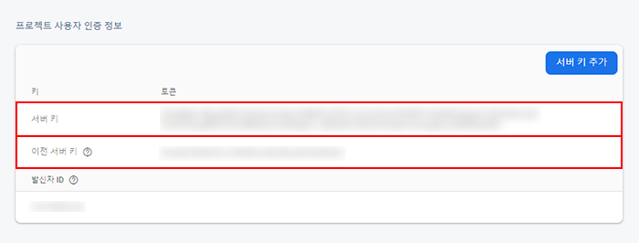

## 💥 문제

FCM 설정 후 메시지 전송시 아래와 같은 오류가 발생하는 경우가 있습니다.

```bash
{"multicast_id":...,"success":0,"failure":1,"canonical_ids":0,"results":[{"error":"MismatchSenderId"}]}
```

## ❗️ 해결

-   Firebase 프로젝트 설정의 클라우드 메시징 > 프로젝트 사용자 인증 정보에서 서버키 또는 이전 서버 키를 확인합니다.

####



####

-   headers의 Authorization에 해당 서버키 또는 이전 서버 키를 삽입합니다.

```javascript
headers = {
    Authorization: 'key=YOUR_KEY',
};
```

####

## 💡 업데이트(2020.04)

2020년 4월 현재 Firebase에서 더 이상 **이전 서버 키**를 제공하지 않습니다.
서버키만 사용 가능합니다.
