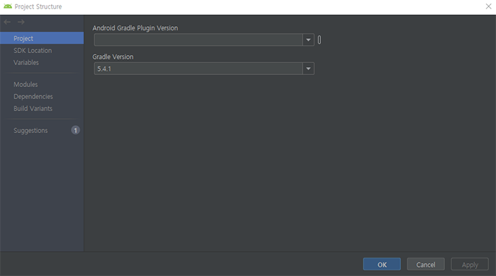
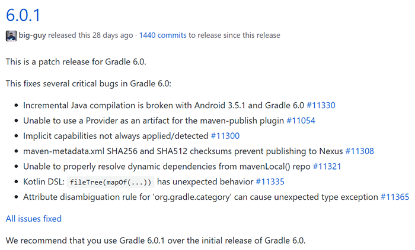
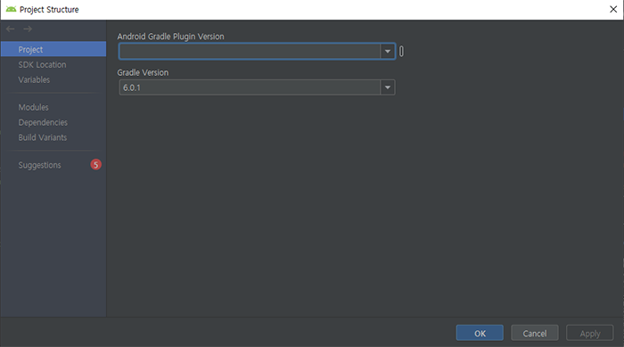
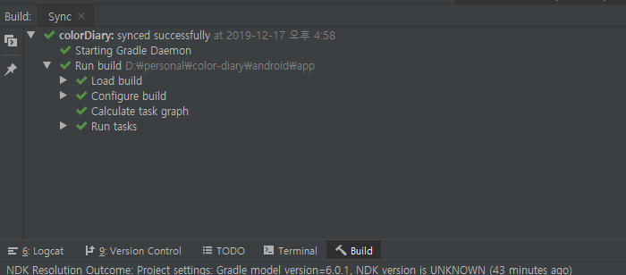

## 📝 배경

오랜만에 리액트 네이티브로 개발 중(?)인 프로젝트 작업을 진행하려고 했는데, react-native run-android를 실행하자마자 여러가지 문제가 발생해서, 계획했던 "splash를 적용하자!"는 물건너갔습니다. 대신 포스팅 거리가 생겼습니다.

처음에 발생한 에러는 JAVA_HOME 환경 변수를 갑자기 잡지 못하는 문제였는데요, JAVA를 삭제(...)하고 재설치 및 환경변수 재설정 등등을 수행해 해결했습니다. [이 포스트](https://dora-guide.com/java-jdk-environment-variables/)가 도움이 됐습니다. 저와 같은 문제를 겪고 계신 분은 저곳을 참고하시기 바랍니다.

JAVA 설정을 마치고 다시 명령을 실행했으나, 이번에는 gradle이 문제였습니다. 찾아보니 gradle 버전이 낮아 발생하는 에러였습니다. gradle 저장소에 [이슈](https://github.com/gradle/gradle/issues/8681)로 등록돼 있었습니다.

## 💥 문제

react-native run-android 실행 후 다음과 같은 에러가 발생하는 경우가 있습니다.

```bash
BUG! exception in phase 'semantic analysis' in source unit '...'
```

## ❗️ 해결

-   먼저 java 버전을 확인합니다.

```bash
$ java -version

java version "13.0.1" 2019-10-15
Java(TM) SE Runtime Environment (build 13.0.1+9)
Java HotSpot(TM) 64-Bit Server VM (build 13.0.1+9, mixed mode, sharing)
```

JDK 13 버전 이상인 경우 gradle을 6 버전 이상으로 업그레이드해야 합니다.

####

-   안드로이드 스튜디오에서 Project Structure를 실행합니다.

####


####

-   gradle 버전이 6 이상인지 확인합니다.

####



####

gradle 저장소를 확인해 보니 6.0.1까지 릴리즈됐습니다. (2019년 12월 현재)

####



####

-   gradle 버전을 수정하고 OK 버튼을 누릅니다.

####



####

-   gradle이 업그레이드되는지 확인합니다.

####



####

-   프로젝트 디렉토리에서 react-native run-android를 실행해 컴파일되는지 확인합니다.

```bash
$ react-native run-android
```
