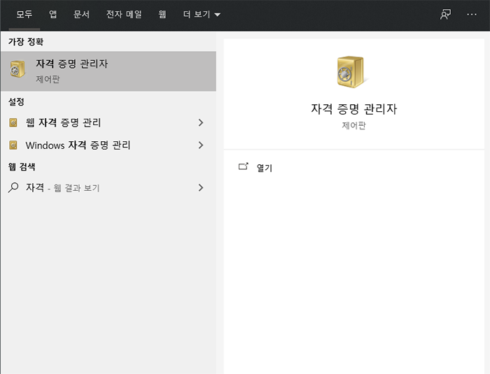
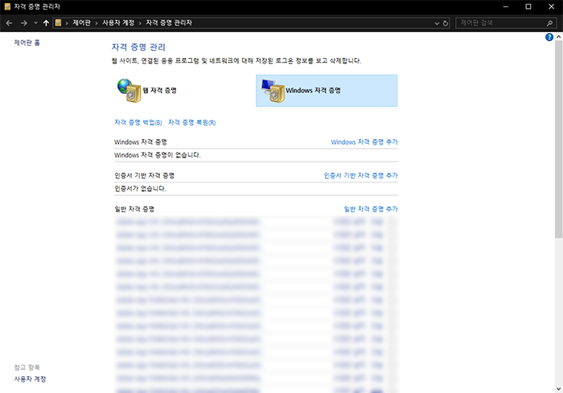
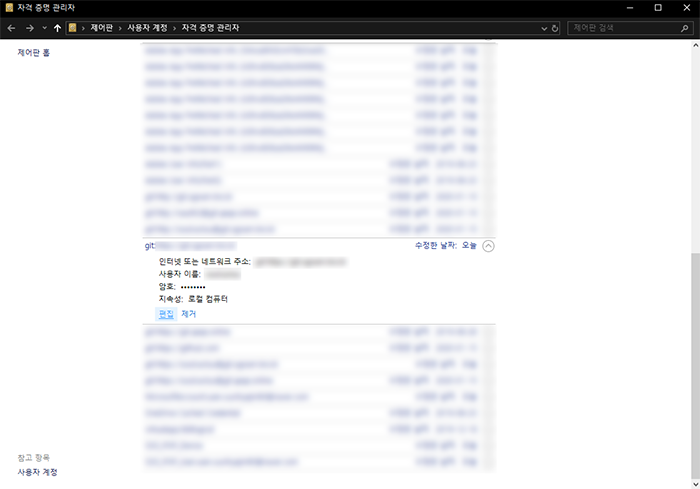
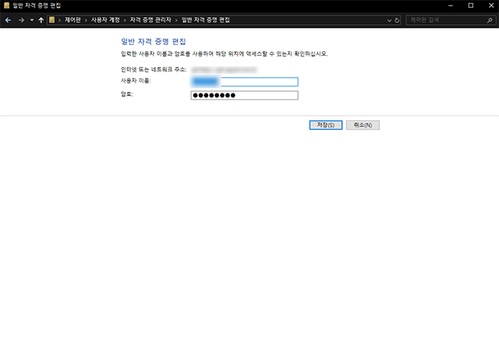

## 💥 문제

Git 사용 중 remote URL 변경 후, 혹은 clone시 아래와 같은 오류가 발생하는 경우가 있습니다.

```bash
Git: remote: HTTP Basic: Access denied
```

## ❗️ 해결

-   자격 증명 관리자를 실행합니다.

####



####

-   Windows 자격 증명을 선택합니다.

####



####

-   해당 Repository의 URL을 선택하고 편집 버튼을 누릅니다.

####



####

-   사용자 이름과 암호를 재설정합니다.

####



####
