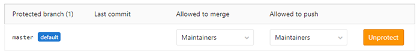

## 💥 문제

Gitlab 사용 중 master branch로 push시 아래와 같은 오류가 발생하는 경우가 있습니다.

```bash
! [remote rejected] master -> master (pre-receive hook declined)
error: failed to push some refs to
```

## ❓ 원인

먼저 해당 프로젝트에서 본인의 permission이 Maintainer인지 Developer인지 확인합니다.
기본적으로 Gitlab에서는 프로젝트의 master branch를 보호합니다.
해당 프로젝트의 permission이 Developer인 팀원들은 master branch로 merge하거나 push할 수 없습니다.
따로 branch를 생성해 작업해야만 합니다.

## ❗️ 해결

Gitlab 설정을 통해 간단히 해결할 수 있습니다.

-   해당 Gitlab 프로젝트의 설정 > 저장소로 접속합니다.
-   Protected Branches를 선택합니다.

####



####

-   Allow to merge / Allow to push를 "Developers + Maintainers"로 수정합니다.

####

단, 모든 Developer에게 master branch 접근 권한이 필요하지 않은 경우 접근 권한이 필요한 팀원만 Maintainer로 지정하는 것도 한 방법입니다.

자세한 사항은 [이곳](https://docs.gitlab.com/ee/user/project/protected_branches.html)을 참고하시기 바랍니다.
