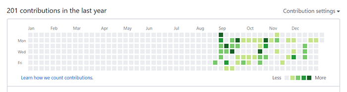

## 💬 들어가며

12월 초부터 회고를 쓸 계획이 있었는데, 중간에 면접 기회가 생겨서 면접 이후에 작성하는 것이 적절하겠다는 판단이 들어 1월이 된 지금에서야 포스팅하게 됐습니다. 개발자로서는 처음으로 작성하는 회고입니다.

미리 말씀드리자면 안타깝게도 이 포스트는 성과보다는 반성 위주의 회고가 될 것 같습니다(...) 하지만 실패를 통해 배우는 점을 기록해 두는 것도 제 성장에 많은 도움이 될 것 같다고 생각해 뼈아프지만 최대한 자세히 기록하기로 마음먹었습니다. 이직 성공기(?) 같은 것을 기대하고 들어오신 분들께는 아쉽지만 이 포스트는 대부분 반성문에 가깝습니다. 😥

## 🎨 디자이너 → 개발자

처음 작성하는 회고이기 때문에 2019년 이전의 이야기를 조금 풀어보도록 하겠습니다. 저는 디자인도, 개발과도 무관한 문과 출신의 비전공자입니다.

휴학 후 운 좋게 디자이너로 취업하게 되어 2016년까지 디자이너로 일했습니다. 디자인을 좋아하고 또 꽤 잘해왔다고 생각했지만, 5년 정도 디자이너로 일하면서 디자이너로서 한계를 느꼈습니다. 제가 속한 곳, 혹은 이직 가능한 풀에서 디자이너로서 저의 발전 가능성이 크지 않다고 판단했습니다.

물론, 작은 곳에서 시작해 뛰어난 디자이너로 성공하신 분들도 많습니다. 좀 더 노력해서 더욱 뛰어난 디자이너로 성장하는 것도 분명 선택지에 있었지만, 한 번 다른 일에 도전해 보고 싶다는 생각을 하기 시작하면서부터 디자인에 급격히 흥미를 잃었던 점이 개발자로 전향하게 된 가장 결정적인 이유였습니다.

그 후, 재직 중인 회사 대표님의 권유도 있었고 스스로도 웹 개발에 흥미를 느껴 HTML, CSS, JavaScript를 학습하기 시작했습니다. 얼마 지나지 않아 실무에 투입됐고 2018년까지는 주로 UX/UI 개발자로서 업무를 수행했습니다.

## 💁 회사

2018년 말부터 초안을 그리기 시작한 프로젝트를 2019년 내내 작업했습니다. ~~아직도 하고 있습니다.~~ 개발 환경에 많은 변화가 있었고, 뛰어난 동료들과 함께할 수 있었고, 쏟아지는 온갖 요구사항과 변경사항, 그 과정에서 겪은 장애에 대응하면서 개발자로서 한 단계 성장하는 데 도움이 된 프로젝트라 많은 애정을 가지고 있습니다. 이제 거의 베타 버전 마무리 단계에 접어 들었습니다. 가입자가 증가하는 속도를 보니 책임감이 무럭무럭 솟아나는(?) 느낌입니다.

간단하지는 않았습니다. 일례로, 배포 자동화 도구가 도입되기 전이었는데 배포를 잘못해서 옆 자리 개발자를 고생시킨 적도 있고(...) 초반에 제 업무 매너 문제로 옆 자리 개발자와 약간의 트러블이 있기도 했고(~~술 마시면서 풀었습니다~~) 좀체 풀리지 않는 로직 때문에 몇날 며칠을 혼자, 때로는 함께 머리를 싸맨 날도 부지기수였습니다. 3월까지는 팀원 모두 거의 매일 야근하기도 했고... 고생스러웠지만 지나보니 즐거운 시간이었던 것 같습니다.(저 혼자만의 감상일 수 있습니다.)

올해부터는 고도화에 집중하게 될 듯합니다. 리액트를 도입할 수 있게 됐습니다. 도입을 위해 나름대로 꾸준히 학습해 왔는데, 리액트를 실무에 적용하는 것은 이번이 처음입니다. 벌써부터 기대(?)됩니다. 새 동료들도 합류하게 될 듯한데 협업에 대해 더 깊이 고민해야겠습니다. 미리미리 코드 컨벤션을 정리하고 테스팅을 도입해 놓는 것이 좋을 듯합니다. 코드리뷰 문화도 도입할 수 있었으면 좋겠습니다.

## 📝 블로그 시작 (2019.8 ~)

이 블로그를 개설하기 전에 티스토리 블로그를 운영하고 있었습니다만, 포스트를 공개하지 않고 비공개로 그때 그때 배운 점들을 정리하는 용도로만 사용했습니다. 잘못된 정보를 전달하는 것은 아닐까, 하는 마음도 있었고 자신감이 조금 부족했던 이유도 있었습니다.

2019년부터는 마음을 고쳐먹고(?) "틀리면 틀리는 대로 피드백을 받자!"는 생각으로 새 블로그를 개설했습니다. 8월이 돼서야 시작했으니 그 동안 꽤 게을렀던 것 같습니다(...) 올해부터는 좀 더 자주 포스팅하는 것을 목표로 잡았습니다. 구체적으로는 한 달에 최소 5편 이상을 목표로 하고 있습니다. 회고도 분기별로 작성하려고 합니다.

## 🏃 토이 프로젝트 시작 (2019.9 ~)

####

####

처참한(...) 커밋 그래프지만 다음 회고와의 비교를 위해 이미지를 첨부했습니다. GitHub를 관리해야 한다는 생각은 늘 마음의 빚처럼 간직하고 있었습니다만, 실천으로 옮기기까지는 꽤 오래 걸렸습니다. 부끄러운 코드를 보여주고 싶지 않은 마음이 컸습니다. 지금은 상당히 잘못된 생각이었다고 생각합니다. "완벽한 코드를 짜야지!" 하고 아무것도 짜지 않는 것만큼 멍청한 생각이었습니다. 😓

Gatsby 블로그를 시작하면서 자연스럽게 저장소를 만든 것을 시작으로 간단한 토이 프로젝트를 배포했습니다. Svelte를 학습하면서 겸사겸사 만든 Todo List App도 배포했습니다. 두 개의 Star와 한 번의 Fork가 있었습니다. 남들 보기엔 별거 아닌 성과겠지만 어쨌든(?) 시작했다는 점에서 저는 2019년의 가장 잘한 일로 꼽고 싶습니다. 올해부터는 스스로 데드라인을 만들어 가며 커밋 그래프에 빽빽하게 잔디를 심을 작정입니다.

## 💦 이직 시도(?)

회사에 만족하고 있는 편이었기 때문에, 사실 이직 생각은 크게 없었습니다. 그런데 면접 제안을 받았습니다. "내가 지원해도 될까?"라는 생각이 절로 들을 정도로 좋은 회사였고, 준비가 안 된 상태라는 것을 스스로 알고 있었기 때문에 걱정이 이만저만이 아니었습니다. 저에 대한 구체적인 정보 없이 주신 연락이었기 때문에, 여러가지로 마음에 걸리는 점도 많았습니다. 그래도 "면접이 나의 현재 상태를 되돌아 볼 수 있는 계기가 된다, 좋은 경험이다"라는 말씀을 해주셔서 떨어지더라도 도전해 보자는 쪽으로 용기를 낼 수 있었습니다.

### 서류

그 동안 이력서 정리를 해두지 않았기 때문에, 서류 전형을 준비하는 것부터 애를 먹었습니다. 프로젝트를 정리해 작성하면서, 경력에 비해 적을 만한 것이 많지 않아 제 경력을 좀 되돌아 보는 계기가 됐습니다. 실제로 이 부분은 면접에서 "경력을 대부분 인정 받지 못할 수도 있습니다. 어떻게 받아들이실 건가요?"라는 질문으로 이어지기도 했습니다.

### 코딩테스트

코딜리티를 통해 3문제를 풀었습니다. 코딩테스트의 기출 문제는 회사의 자산이기 때문에 공개할 수 없으나, 테스트 케이스를 충분하게 작성하고 문제를 꼼꼼하게 읽고 푸는 것이 중요한 것 같습니다. 당연한 이야기지만, 평소에 알고리즘 문제를 꾸준히 풀어보는 것도 도움이 될 것 같습니다. "최소한의 검증"이라고 생각될 만큼 합리적인 수준의 문제였다고 생각합니다.

문제는 제 상태였습니다. 알고리즘 풀이를 일년 넘게 손놓고 있다가 코딩테스트 관련 메일을 받고 부랴부랴 준비했습니다(...) 코딩테스트의 경우에는 면접에서 "가장 아쉬운 문제가 있다면?", "다시 풀어볼 수 있겠나요?" 등의 질문을 받았으나, 회피하듯 하는 인상을 줄 수 있는 만족스럽지 않은 답변을 했습니다.(테스트 이후에 따로 시간을 내서 풀어봤으나 놓친 케이스가 잘 떠오르지 않았다, 그때 작성한 코드를 봐야할 것 같다는 식의 답변을 했습니다... 😭)

### 기술면접

2대 1, 3대 1, 투 트랙으로 면접이 진행된다고 면접 안내 메일을 받았을 때, 둘 중 하나는 코딩테스트겠다 어느 정도 예상은 했습니다. 자료구조 구현이나, 피보나치 등의 간단한 손코딩을 할 수도 있다는 후기들을 보고 대부분 그쪽으로 준비했는데, 실제로 면접장에 들어가니 실무에 가까운 라이브 코딩이 기다리고 있었습니다. 여기서 1차 멘붕이 왔습니다.

어려운 문제는 아니었습니다. 면접의 코딩테스트 또한 합리적인 수준의 문제였다고 생각합니다. 그래서 더욱 뼈아픈 것 같습니다. 두 문제 모두 끝까지 해결하지 못했고, 기본기가 없다고 판단될 만한 모습을 테스트 내내 보였습니다(...) 탈락은 이때 이미 예감했습니다.

코딩테스트를 마치고는 구술 면접을 봤습니다. 경력과 인성, 노력, 기초적인 자바스크립트와 자료구조에 대한 질문을 받았습니다. 코딩테스트를 망쳤기 때문에 반쯤 내려놓은 상태에서(...) 긴장하지 않고 차분히 대답했다고 생각했으나, 지나고 나니 후회스러운 답변이 많았습니다.

면접관 분들께서 면접 분위기를 편하게 해주시려고 노력하는 모습과, 흘러가듯 자연스러운 대화 속에서도 날카로운 질문을 놓치지 않는 점이 멋지다고 생각했습니다. 납득할 만한 채용 프로세스가 좋은 인상으로 남았습니다. ~~납득이 안 되는 건 제 상태일 뿐...~~

### 결과

결과는 탈락. 엄청나게 빠른 피드백이 왔습니다(...) 눈물을 머금고 감사 메일을 보내는 것으로 짧지만 길게 느껴졌던 채용 프로세스를 마무리했습니다.

## 💬 마치며

채용 프로세스를 밟으면서 도전 의식이 생겼고, 개인적으로 저를 돌아보는 데 엄청난 계기가 됐습니다. 면접 보기 전 "노력은 누구나 한다, 잘하는 것이 중요하다"는 조언을 들었는데, 올해는 "잘하는 개발자"가 되는 것을 목표로 두고 성장할 수 있도록 노력해야겠습니다. 증명 가능한 개발자가 되고 싶습니다.
