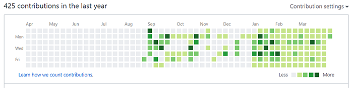

## 💬 들어가며

벌써 2020년의 4분의 1이 지났습니다. 올해의 다짐 중 하나인 **분기별 회고**를 하기 위해 포스팅합니다. 두 번째 회고입니다.
이번에도 역시 반성문(...)이 될 듯하지만 기록하는 습관은 좋은 것이니 어디 한번(?) 작성해 보겠습니다.

## 💁 회사

부족했던 체계가 조금씩(?) 잡혀가는 것 같습니다. 협업 툴로 노션(Notion)을 도입하게 됐습니다. 노션에 대해서는 조만간 도입기, 사용기를 포스팅하도록 하겠습니다.

프로젝트 마무리 단계에 있고, 새 프로젝트를 준비하느라 틈틈이 TypeScript를 학습하고 있습니다. 뒤늦은 감이 있지만 늦었다고 생각할 때가 가장 빠르다고 믿고 학습하고 있습니다. 😅

새 프로젝트에는 Storybook과 Cypress를 도입하기로 했습니다. 새 프로젝트 시작하면 며칠은 개발환경 구축으로 고생 좀 할 듯합니다.

그리고 팀에 UX/UI 디자이너 동료가 새로 들어오셨는데 그 분께서 Axure라는 신세계(?)를 열어주셨습니다. ✨
스터디메이트였던 타 팀 FE분도 새 프로젝트부터는 함께하게 됐습니다.

전쟁까지는 아니지만 저와 팀원들 모두 매일 매일 치열하게 일하고 있는데, 막상 크게 적을만 한 이야기는 많지 않은 것 같습니다.
오히려 다들 열심히 하고 있기 때문에 순조롭게 가고 있는 느낌입니다.

## 📝 블로그

블로그 관리에 소홀했습니다. 포스팅 퀄리티는 고사하고 **한 달에 최소 5편**이라고 연초에 다짐했는데(...) 지키지 못했습니다.
요즘은 방문자 수가 조금 늘어나서 양보다는(?) 퀄리티 있는 포스트를 작성해 올리고 싶은 마음이 좀 더 큽니다. 블로그도 이사하고 싶고... 라고 쓰고 다음 분기 회고에서 반성하는 일은 없어야 할텐데요. 😓

**읽을 만한 글**에 대해 고민하고 있습니다.
단순히 문제 해결 방법을 나열하는 포스팅이 아니라(물론 경우에 따라서는 간결한 쪽이 도움이 될 수 있겠지만) 문제 해결 과정에서 알게된 것에 좀 더 살을 붙여 설명하고 싶은 욕심이 생겼습니다.

처음부터 거창하게 "이렇게 쓰자!"라고 다짐하면 그나마 하던 또 포스팅도 미룰 수 있으니(...) 기존의 스타일을 유지하되 좀 더 나은 방향을 고민해 봐야겠습니다. 이번 분기에는 너무 많은 다짐을 하지 않기로 했습니다. 😑

## 🏃 토이 프로젝트

왠지 토이 프로젝트라고 쓰고 GitHub 잔디 근황(...)이라고 고쳐 적어야할 것 같은 느낌이라 일단 이미지 먼저 첨부해 보겠습니다.

####

####

토이 프로젝트로 organizational chart 모듈을 만들고 있는데 프로젝트하지 않는 날에는 주로 공부한 내용을 정리해 올리고 있습니다.
도서를 베이스 삼아 공부하고, 따로 알아본 내용 등을 합쳐서 하나의 문서로 만들고 있기 때문에 저작권을 고려해 프라이빗으로 정리하고 있습니다.
토이 프로젝트도 아직 갈 길이 멀어서 공개하지 않았습니다.

지난 회고 이후로 1일 1커밋을 유지 중이긴 합니다만, 1일 1커밋을 위해 별 의미 없이 간단하게 커밋한 날도 꽤 있었습니다.
최근에는 무의미한 커밋을 하면서도 바쁨을 핑계로 좀 무감각해져서, 경각심을 가져야겠다는 생각이 듭니다.
심는 것(?)에 의의를 두면 안 되겠습니다. ~~개발을 해야지 잔디 농사를 지으면 안 되죠.~~

## 📚 독서

심심풀이로 읽는 책 외에 업무 관련한 도서는 **자바스크립트 자료 구조와 알고리즘**, **코어 자바스크립트**, **OKR 전설적인 벤처투자자가 구글에 전해준 성공 방식**을 읽었습니다.
현재는 **타입스크립트 마스터 2/e**를 읽고 있습니다.

자바스크립트 자료 구조와 알고리즘, 코어 자바스크립트를 통해 도메인 지식을 좀 더 넓힐 수 있는 시야를 확보하게 됐고, OKR에 대해서는 아직 고민하고 있습니다.
형식이 아니라 철학인 건 이해하겠는데, 그럼에도 불구하고 "그래서 어떻게?"라는 의문이 떠나지 않아서 좀 더 살펴봐야 할 것 같습니다.
제가 납득하지 못한 상태로 누군가를 설득할 수 있을 것 같지 않습니다.

## 💬 마치며

코로나로 인해 상반기에 예정했던 시험들이 줄줄이 취소돼서 그 핑계로 자격증 공부는 잠시 쉬고 있습니다. ~~모동숲을 열심히 하고 있습니다.~~
KCD도 참석하려고 했다가 아쉽게도 취소돼 참석하지 못했습니다. 하루 빨리 코로나가 진정됐으면 좋겠습니다.
그리고 부디 다음 회고에서는 반성보다는 자랑(?) 위주의 회고를 하고 싶습니다.
