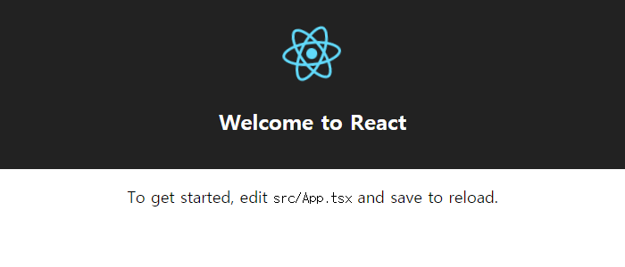

## 📝 배경

타입스크립트 도입에 대한 고민이 항상 있었습니다. 대표적인 이유로는 생산성 문제 때문이었는데요, NextJS 9버전에서 내장형 TypeScript를 지원하기 시작하면서 도입 쪽으로 생각을 굳혔습니다.

아마 신년부터 시작하는 사내 프로젝트에서부터 도입하게 될 듯합니다. 특히 매번 propTypes를 선언하느니(...) 그냥 TypeScript를 사용하는 편이 낫다는 판단이 들었습니다.

코드 자체가 하나의 문서가 되는 것이 가장 큰 강점인 듯합니다. 물론 제네릭 등 낯선 개념들이 몇몇 있긴 하지만 기본적으로 타입스크립트는 자바스크립트이기 때문에 러닝커브에 대한 압박은 없습니다.

그 동안은 그냥 "익숙하지 않음", "자바스크립트의 자유분방함이 좋음", "언제 타입을 일일이 선언해? 귀찮음", "굳이?" 등의 자기합리화를 했던 것 같습니다.

최근 도입 쪽으로 생각을 굳힌 뒤, 버그를 마주할 때마다 "자바스크립트의 자유분방함이 좋아!"라는 생각이 얼마나 터무니 없고 나이브한 생각이었는지 잠시 반성의 시간을 가졌습니다(...) 고민은 사실 그냥 변명에 불과했습니다. 도입을 더 미룰 수 없다는 생각입니다.

## 📁 create-react-app with TpyeScript 설치

-   다음과 같이 입력해 CRA TypeScript 프로젝트를 생성합니다.

```bash
$ npx create-react-app my-app --scripts-version=react-scripts-ts
```

## 📁 디렉토리 구조

프로젝트 디렉토리 구조는 아래와 같습니다.

```tree
├─public
│      favicon.ico
│      index.html
│      manifest.json
│
└─src
        App.css
        App.test.tsx
        App.tsx
        index.css
        index.tsx
        logo.svg
        registerServiceWorker.ts
```

## 🏃 프로젝트 시작

-   아래 명령어를 입력하면 다음과 같이 실행됩니다.

```bash
$ cd my-app
$ npm start
# open localhost:3000
```

####



####
