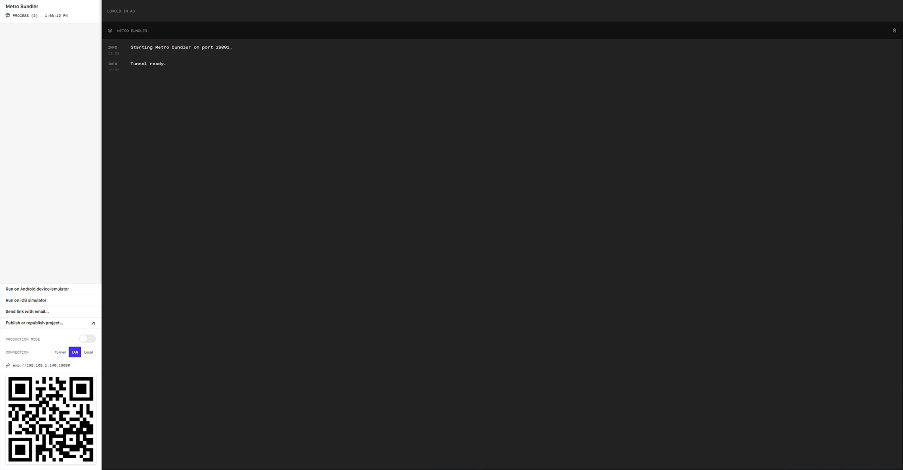
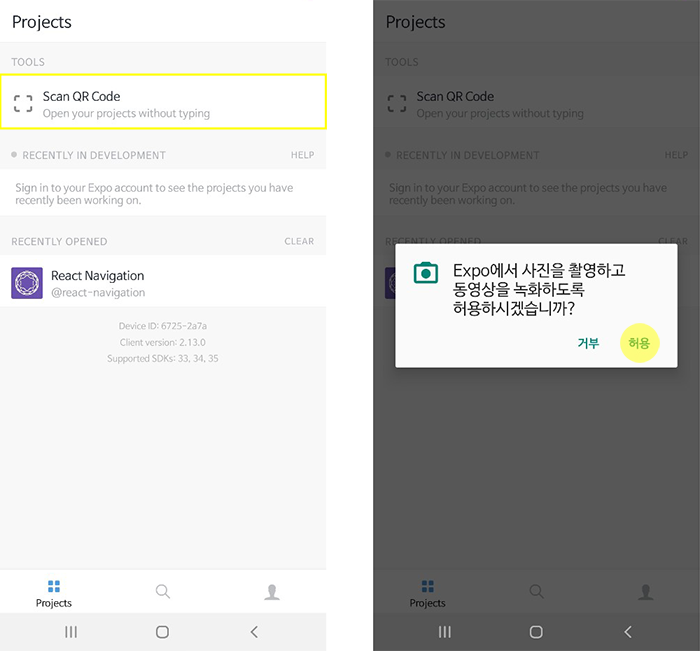
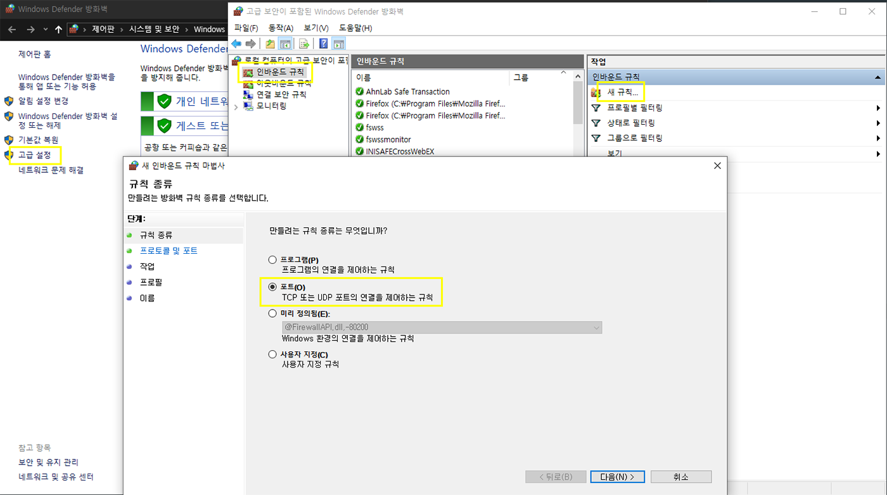
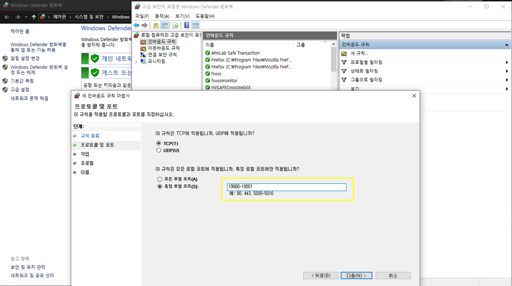

####

## 📁 create-react-native-app 설치

-   먼저 create-react-native-app을 전역으로 설치합니다.

```bash
$ npm i -g create-react-native-app
```

## 📁 프로젝트 생성

-   다음과 같이 프로젝트를 생성합니다.

```bash
$ create-react-native-app my-app
```

## 📁 템플릿 선택

-   템플릿을 선택합니다.

```bash
? Choose a template: (Use arrow keys)
  ----- Managed workflow -----
> blank                 a minimal app as clean as an empty canvas
  blank (TypeScript)    same as blank but with TypeScript configuration
  tabs                  several example screens and tabs using react-navigation
  ----- Bare workflow -----
  minimal               bare and minimal, just the essentials to get you started
  minimal (TypeScript)  same as minimal but with TypeScript configuration
```

## 📁 name 설정

```bash
 {
   "expo": {
     "name": "my-app",
     "slug": "my-app"
   }
 }
```

## 🏃 프로젝트 시작

-   아래 명령어를 입력하면 다음과 같이 실행됩니다.

```bash
$ cd my-app
$ npm start
# open localhost:19002
```

####



####

## 💎 Expo 설치 및 실행

-   디바이스에서 Play Store 혹은 App Store에 접속해 Expo를 설치 후 QR코드를 촬영합니다.

####



####

## 🤔 Something went wrong?

-   다음과 같은 에러가 발생하는 경우가 있습니다.

####


####

-   방화벽 > 고급설정 > 인바운드 규칙 > 새 규칙 > 포트를 선택해 다음과 같이 적용합니다.

####



####



####

-   ipconfig 명령어를 이용해 내부 아이피 주소를 확인 후 아래와 같이 입력합니다.

```bash
export REACT_NATIVE_PACKAGER_HOSTNAME=your ip
```

-   npm 재실행 후 Expo를 실행해 QR 코드를 다시 촬영합니다.

```bash
$ npm start
```
