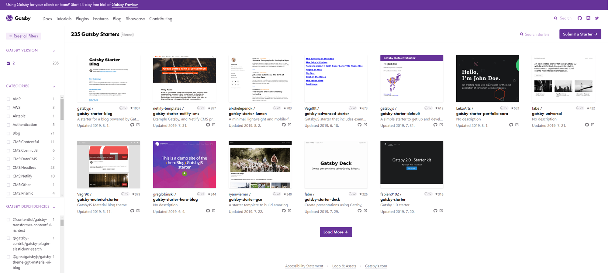
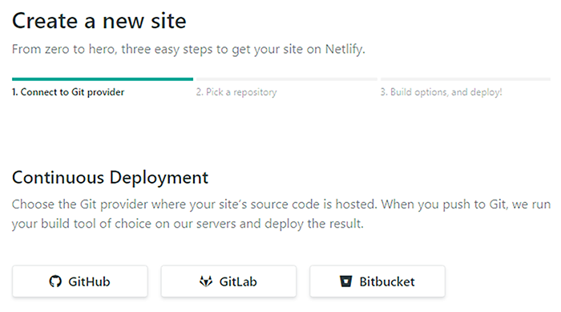
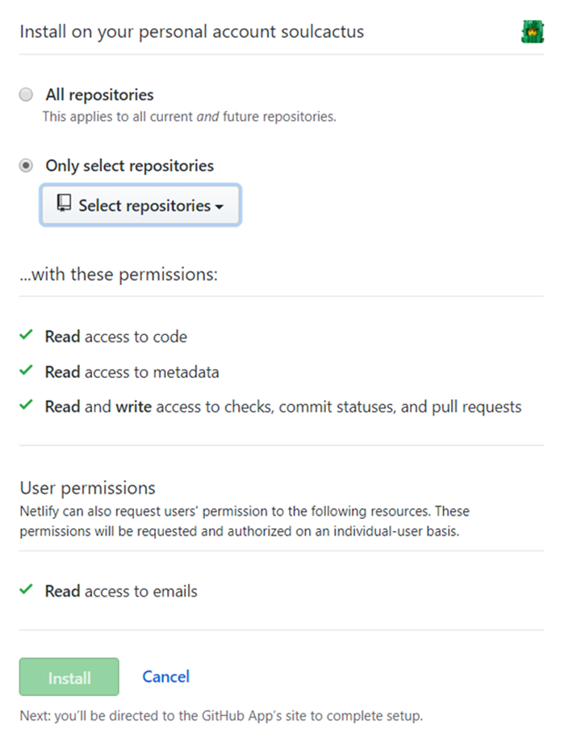
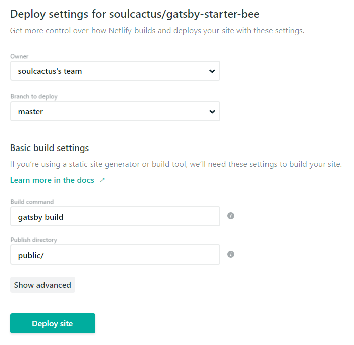

## 📝 배경

올해 초부터 블로그를 하나 만들어야지 했는데, 벌써 8월입니다. 😅

그동안 아예 시도를 안 했던 것은 아닙니다.
[Jekyll](https://jekyllrb.com/)을 이용해서 간단하게 구축해 볼까 했는데,
Gem-based Themes를 적용하는 과정에서 발생하는 엄청난 에러의 압박과 회사 프로젝트 일정 등(?)의 압박으로 인해 잠시 미뤄뒀습니다.

무엇보다 Jekyll은 디자인이 가장 문제였는데, 원하는 정도로 커스터마이징하는 것이 만만치 않아 보였습니다.
결론은 이것저것 그닥 간단하지 않았습니다.

## 💎 GatsbyJs

공식 홈페이지 소개에 따르면 [GatsbyJs](https://www.gatsbyjs.org/)는 React를 위한 엄청나게 빠른 모던 사이트 생성기입니다.
React 기반에 GraphQL를 사용했다고 합니다. 구글링하다 우연히 발견했고, 보자마자 이거다 싶었습니다.

정적 사이트 생성기에 대해서는 다른 포스트에서 다루겠습니다.
GraphQL에 관해서는 조만간 GraphQL, Apollo, Parcel을 조합해 사용해 보고 후기를 올릴 예정입니다.

## ⭐️ 선택



####

심플하고 깔끔한 UI를 선호하지만 있을 건 다 있어야 하고 아기자기하게 예쁘기까지 해야하는 나름(?)의 취향이 있기 때문에 Starter를 선택하는 것이 문제라면 문제였습니다.

처음에는 인기있는 Starter인 [gatsby-starter-lumen](https://www.gatsbyjs.org/starters/alxshelepenok/gatsby-starter-lumen/)을 사용해 볼까 했는데
코드블럭 테마가 좀처럼 눈에 띄지 않아 마음에 들지 않았습니다.
그러던 중 발견한 [gatsby-starter-bee](https://www.gatsbyjs.org/starters/JaeYeopHan/gatsby-starter-bee/)가 마음에 들었습니다.

## 📁 설치

[gatsby-starter-bee 공식 가이드(한국어)](https://github.com/JaeYeopHan/gatsby-starter-bee/blob/master/README.ko.md)

### 1. Gatsby 프로젝트 시작

```bash
# create a new Gatsby site using the blog starter
$ npx gatsby new my-blog-starter https://github.com/JaeYeopHan/gatsby-starter-bee
```

또는

```bash
$ npm install -g gatsby-cli
$ gatsby new my-blog-starter https://github.com/JaeYeopHan/gatsby-starter-bee
```

### 2. 로컬에서 확인

```bash
$ cd my-blog-starter/
$ npm start
# open localhost:8000
```

간단합니다. 커스터마이징은 각자의 몫이니 이 포스트에서는 다루지 않겠습니다.

## 🌟 배포

### 1. Netlify

-   [Netlify](https://www.netlify.com/)에 접속하여 계정을 생성합니다.
-   New site from Git 버튼을 클릭합니다.
-   GitHub, GitLab, Bitbucket 중 하나를 선택해 연결합니다.

####



####

-   저장소를 선택하고 Netlify를 설치합니다.

####



####

-   빌드 옵션을 입력하고 Deploy site 버튼을 클릭하면 배포가 완료됩니다.

####



### 2. github pages

-   package.json에 아래 코드를 추가합니다.

```json
"scripts": {
    "deploy": "gatsby build && gh-pages -d public -b master -r 'git@github.com:${your github id}/${github page name}.github.io.git'"
}
```

-   gh-pages 패키지를 설치합니다.

```bash
$ npm i --save-dev gh-pages
```

-   빌드를 진행합니다.

```bash
$ npm run deploy
```
