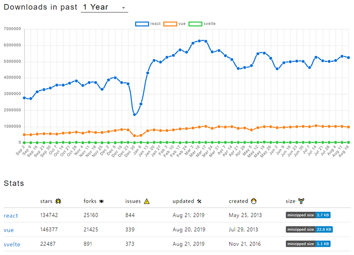
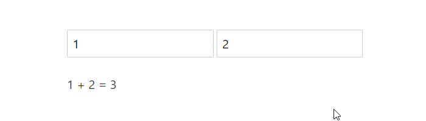

####

이 포스트는 [Svelte](https://svelte.dev/) 공식문서를 참고했습니다.

## 💎 SvelteJS란?

Svelte는 [React](https://reactjs.org/), [Vue](https://kr.vuejs.org/)와 같은 컴포넌트 프레임워크지만 중요한 차이점이 있습니다.

기존의 프레임워크를 사용할 때는 <q>선언적인 상태 주도적 코드(declarative state-driven code)</q>를 작성합니다. 하지만 이런 방식은 패널티가 뒤따릅니다. 프레임을 낭비하고 가비지 컬렉터 작업에 부하를 주는 virtual DOM과 같은 기술을 사용하면, 선언적 구조를 DOM 작업으로 변환하기 위해 브라우저가 추가 작업을 해야하는 것이죠.

이에 반해 Svelte는 빌드 타임에서 실행되며, 매우 효과적으로 DOM을 업데이트하는 명령형 코드로 컴포넌트를 변환합니다.

## 💡 SvelteJS 특징

-   기존에 알고 있는 HTML, CSS, JavaScript를 사용해 create-react-app과 같은 보일러플레이트에서 자유로운 컴포넌트를 구축할 수 있습니다.
-   React, Vue와 달리 virtual DOM을 사용하지 않고, 코드를 작고 framework-less한 vanilla JavaScript로 컴파일합니다.
-   복잡한 상태관리 라이브러리가 필요하지 않습니다.

## ✨ SvelteJS 전망

2019년 8월 현재 v3.9.0까지 릴리즈됐으며, GitHub star 수는 22K입니다.  
후발 주자인 만큼 아직까진 관심이 높진 않으나, 꾸준히 증가하는 추세입니다.

####



## 📝 React, Vue, Svelte 코드 비교



위와 같이 input 값을 처리하는 기능을 React를 이용해 구현하면 아래와 같습니다.

```javascript
import React, { useState } from 'react';

export default () => {
    const [a, setA] = useState(1);
    const [b, setB] = useState(2);

    function handleChangeA(event) {
        setA(+event.target.value);
    }

    function handleChangeB(event) {
        setB(+event.target.value);
    }

    return (
        <div>
            <input type="number" value={a} onChange={handleChangeA} />
            <input type="number" value={b} onChange={handleChangeB} />

            <p>
                {a} + {b} = {a + b}
            </p>
        </div>
    );
};
```

다음은 Vue를 이용해 구현한 예제입니다.

```javascript
<template>
  <div>
    <input type="number" v-model.number="a">
    <input type="number" v-model.number="b">

    <p>{{a}} + {{b}} = {{a + b}}</p>
  </div>
</template>

<script>
  export default {
    data: function() {
      return {
        a: 1,
        b: 2
      };
    }
  };
</script>
```

다음은 Svelte를 이용해 구현한 예제입니다.

```javascript
<script>
	let a = 1;
	let b = 2;
</script>

<input type="number" bind:value={a}>
<input type="number" bind:value={b}>

<p>{a} + {b} = {a + b}</p>
```

기초적인 HTML, JavaScript 지식만 가지고도 이해하기 쉽고 훨씬 간결하죠?  
다음 포스트에서는 Svelte 기초 문법을 다뤄보도록 하겠습니다.
