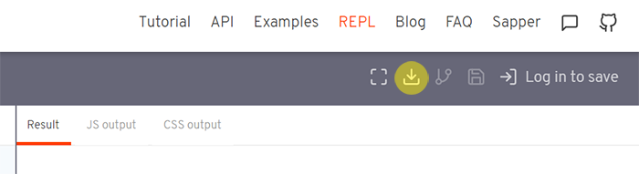

####

이 포스트는 [Svelte](https://svelte.dev/) 공식문서를 참고했습니다.

## 📁 REPL을 이용해 설치

-   먼저 [이곳](https://svelte.dev/repl/hello-world?version=3.12.1)에서 svelte-app.zip 파일을 다운로드합니다.

####



####

-   압축을 해제한 뒤 터미널에서 해당 디렉토리로 이동합니다.

```bash
$ cd /path/to/svelte-app
```

-   패키지 파일을 설치합니다.

```bash
$ npm install
```

-   설치가 완료되면 아래의 명령어를 통해 개발모드를 실행합니다.

```bash
$ npm run dev
```

-   localhost:5000에 접속하면 아래와 같은 화면을 확인할 수 있습니다.

####


####

## 📁 degit을 이용해 설치

-   터미널에 다음과 같이 입력하여 새 svelte 프로젝트 디렉토리를 생성합니다.

```bash
$ npx degit sveltejs/template my-svelte-project
```

-   마찬가지로 해당 디렉토리로 이동해 패키지 파일을 설치한 뒤 개발모드를 실행합니다.

```bash
$ cd my-svelte-project
$ npm install
$ npm run dev
# open localhost:5000
```

## 💎 Svelte로 Todo List App 만들기

1. [Svelte 설치하기(Quick Start)](https://soulcactus.netlify.com/svelte/start-svelte/)
2. [Svelte로 Todo List App 만들기(1) - 레이아웃](https://soulcactus.netlify.com/svelte/todo-list-1/)
3. [Svelte로 Todo List App 만들기(2) - 데이터 생성, 읽기, 갱신, 삭제(CRUD) Part.1](https://soulcactus.netlify.com/svelte/todo-list-2/)
4. [Svelte로 Todo List App 만들기(3) - 데이터 생성, 읽기, 갱신, 삭제(CRUD) Part.2](https://soulcactus.netlify.com/svelte/todo-list-3/)
5. [Svelte로 Todo List App 만들기(4) - 스토어를 이용한 상태 관리](https://soulcactus.netlify.com/svelte/todo-list-4/)

####

-   [DEMO](https://svelte-todo-list-demo.netlify.com/)
-   [GitHub Repo](https://github.com/soulcactus/svelte-todo-list)
