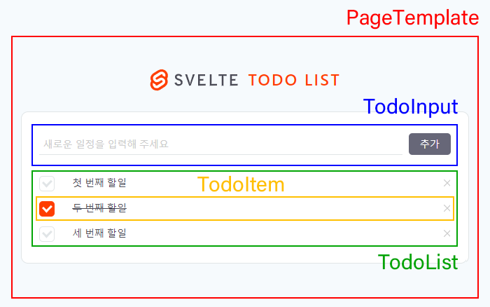

이 포스트는 [Svelte 설치하기(Quick Start)](https://soulcactus.netlify.com/svelte/start-svelte/)와 이어집니다.

## 📁 디렉토리 구조

프로젝트 디렉토리 구조는 아래와 같습니다.

```tree
└─src
    │  App.svelte
    │  main.js
    │
    ├─components
    │      PageTemplate.svelte
    │      TodoInput.svelte
    │      TodoItem.svelte
    │      TodoList.svelte
    │
    ├─images
    │      remove-icon.svg
    │      svelte-logo-horizontal.svg
    │
    └─styles
            global.scss
            modules.scss
            variables.scss
```

## 🔎 컴포넌트 구성

컴포넌트 구성은 아래와 같습니다.

####



####

## 🎨 전역 스타일링

PostCSS보다 Sass를 선호하기 때문에 이번 튜토리얼에서도 Sass를 사용했습니다.

####

-   먼저 node-sass와 svelte-preprocess를 설치합니다.

####

> svelte-preprocess는 SVELTE 앱에서 PostCSS, SCSS, Less, Stylus, Coffeescript, TypeScript, Pug의 컴파일을 지원하는 모듈입니다.

####

```bash
$ npm i node-sass svelte-preprocess
```

-   그 다음 rollup.config.js에 설정을 추가합니다.

```javascript{4, 12}
// rollup.config.js

// add this import
import autoPreprocess from "svelte-preprocess";

// and inside the svelte plugin
export default {
  /* ... */
  plugins: [
    svelte({
      /* ... */
      preprocess: autoPreprocess()
    })
  }),
  /* ... */
}
```

### modules.scss

####

-   styles 디렉토리 생성 및 modules.scss 파일을 추가합니다.

####

> 자주 사용하는 mixin을 모아둔 파일을 추가했습니다.

####

```scss
// src/styles/modules.scss

@mixin size($width, $height) {
    width: $width;
    height: $height;
}

@mixin bg-img($url, $size) {
    background-image: url($url);
    background-repeat: no-repeat;
    background-size: $size;
}

@mixin ellipsis {
    overflow: hidden;
    text-overflow: ellipsis;
    -webkit-line-clamp: 1;
    -webkit-box-orient: vertical;
}

@mixin space-between($wrap: wrap) {
    display: flex;
    justify-content: space-between;
    flex-wrap: $wrap;
}

@mixin flex-start($wrap: wrap) {
    display: flex;
    justify-content: flex-start;
    flex-wrap: $wrap;
}

@mixin center {
    display: flex;
    align-items: center;
    justify-content: center;
}

@mixin align-center($position: absolute) {
    position: $position;
    top: 50%;
    left: 50%;
    transform: translate(-50%, -50%);
}

@mixin for-size($size) {
    @if $size == mobile-portrait {
        @media (max-width: 575.98px) {
            @content;
        }
    } @else if $size == mobile-landscape {
        @media (max-width: 767.98px) {
            @content;
        }
    } @else if $size == tablet-portrait {
        @media (max-width: 991.98px) {
            @content;
        }
    } @else if $size == tablet-landscape {
        @media (max-width: 1199.98px) {
            @content;
        }
    }
}
```

### variables.scss

####

-   variables.scss 파일을 추가합니다.

####

> 전역으로 사용하는 변수들을 모아둔 파일입니다.

####

```scss
// src/styles/variables.scss

// body
$body-background-color: #f6fafd;
$body-text-color: #4a4a55;

// theme
$svelte-theme-color: #ff3e00;

// button
$button-background-color: #676778;
$button-hover-background-color: #4a4a57;

// border
$border-color: #e1e5e7;

// placeholder
$placeholder-color: #ccc;
```

### global.scss

####

-   global.scss 파일을 추가합니다.

####

> SVELTE는 기본적인 global.css를 제공하는데요, 저는 별도로 global.scss 파일을 추가했습니다. 저처럼 styles 디렉토리를 따로 만들지 않고 컴포넌트 내부에 선언하는 방식도 얼마든지 가능합니다.

####

```scss
// src/styles/global.scss

@import './styles/modules.scss';
@import './styles/variables.scss';

:global(html) {
    font-size: 62.5%;
}

:global(body) {
    background: $body-background-color;
    font-size: 1.4rem;
    color: $body-text-color;
}

:global(div) {
    box-sizing: border-box;
}

:global(li) {
    list-style: none;
}
```

SVELTE에서 전역으로 스타일을 지정할 때는 :global(...)을 이용해 작성해야 합니다.

-   App.svelte에서 기존 style 태그에 global.scss를 적용합니다.

```javascript{4}
// src/App.svelte

/* ... */
<style lang="scss" src="./styles/global.scss"></style>
/* ... */
```

scss를 사용하려면 보시는 바와 같이 style 태그에 lang="scss" 속성을 추가해야 합니다.

## 💎 컴포넌트 생성

### PageTemplate.svelte

####

-   components 디렉토리를 생성하고 PageTemplate.svelte 파일을 추가합니다.

####

> SVELTE는 별도의 확장자를 사용합니다. SVELTE는 virtual DOM을 사용하지 않고 빌드 타임에 실행되며 컴포넌트를 컴파일합니다.

####

```javascript
// src/components/PageTemplate.svelte

<h1>
  
  title
</h1>
<div>
  <slot />
</div>
```

마크업 구조는 위와 같습니다. slot은 자식 컴포넌트를 받아서 렌더링하고 싶을 때 사용합니다. vue 등에서도 지원하는 방식입니다.

-   스타일을 추가합니다.

```javascript{3-29}
// src/components/PageTemplate.svelte

<style lang="scss">
  @import "../styles/variables.scss";

  h1 {
    margin: 1.8rem 0 3.1rem;
    text-align: center;
    letter-spacing: 0.225rem;
    font-size: 2.3rem;
    font-weight: 500;
    color: $svelte-theme-color;

    img {
      width: 12.8rem;
      margin-right: 0.5rem;
      margin-bottom: -1.1rem;
    }
  }

  div {
    width: 64rem;
    margin: 2rem auto;
    border: 0.1rem solid $border-color;
    border-radius: 1rem;
    padding: 3rem 2.5rem 0;
    background: white;
  }
</style>

<h1>
  
  title
</h1>
<div>
  <slot />
</div>
```

variables.scss 파일을 import하고 스타일을 작성했습니다. <b>이때, h1과 img, div 태그에 적용된 스타일은 컴포넌트 내부의 h1과 img, div 태그에만 자동으로 적용됩니다. 전역으로 적용되지 않습니다.</b>

-   props를 설정한 다음 적용합니다.

####

> 공식문서 예제처럼 script, style, 마크업 순서로 작성했으나, 순서는 크게 중요하지 않습니다.

####

```javascript{3-6, 13-14}
// src/components/PageTemplate.svelte

<script>
  export let logo;
  export let title;
</script>

<style lang="scss">
  /* ... */
</style>

<h1>
  
  {title}
</h1>
<div>
  <slot />
</div>
```

SVELTE에서 component prop을 정의하기 위해서는 export를 사용합니다.

### TodoInput.svelte

####

-   TodoInput.svelte 파일을 추가하고 스타일과 마크업을 작성합니다.

```javascript
// src/components/TodoInput.svelte

<style lang="scss">
  @import "../styles/modules.scss";
  @import "../styles/variables.scss";

  input {
    width: calc(100% - 6.9rem);
    border: 0;
    border-radius: 0;
    border-bottom: 0.1rem solid $border-color;
    outline: none;

    &:focus {
      border-color: $svelte-theme-color;
      transition: all 200ms linear;
    }

    &::placeholder {
      color: $placeholder-color;
    }
  }

  button {
    @include size(6rem, 3.1rem);
    margin-left: 0.5rem;
    border: 0;
    border-radius: 0.5rem;
    background: $button-background-color;
    color: white;
    cursor: pointer;

    &:hover {
      background: $button-hover-background-color;
      transition: all 200ms linear;
    }
  }
</style>

<input type="text" placeholder="새로운 일정을 입력해 주세요" />
<button type="button">추가</button>
```

### TodoItem.svelte

####

-   TodoItem.svelte 파일을 추가하고 icon을 import한 다음, 스타일과 마크업을 작성합니다.

```javascript
// src/components/TodoItem.svelte

<script>
  import icon from "~/images/remove-icon.svg";
</script>

<style lang="scss">
  @import "../styles/modules.scss";
  @import "../styles/variables.scss";

  li {
    @include space-between;
    margin: 1rem 0;

    &:first-child {
      margin-top: 0;
    }

    &:last-child {
      margin-bottom: 0;
    }
  }

  input {
    display: none;

    &:checked {
      & + label {
        border-color: $svelte-theme-color;
        background: $svelte-theme-color;

        &::after {
          animation: check 800ms;
          border-color: white;
        }
      }
    }
  }

  label {
    display: inline-block;
    @include size(2rem, 2rem);
    position: relative;
    border: 0.1rem solid $border-color;
    border-radius: 0.5rem;
    cursor: pointer;

    &::after {
      content: "";
      display: inline-block;
      @include size(0.6rem, 0.9rem);
      position: absolute;
      top: 0.9rem;
      left: 0.25rem;
      border-right: 0.3rem solid $border-color;
      border-top: 0.3rem solid $border-color;
      transform: scaleX(-1) rotate(135deg);
      transform-origin: left top;
    }

    &:hover {
      &::after {
        border-color: $border-color;
      }
    }
  }

  @keyframes check {
    0% {
      @include size(0, 0);
    }

    25% {
      @include size(0.6rem, 0);
    }

    50% {
      @include size(0.6rem, 0.9rem);
    }
  }

  span {
    flex-basis: 86%;
    word-break: break-all;

    &.done {
      text-decoration: line-through;
    }
  }

  button {
    border: 0;
    padding: 0;
    background: none;
    cursor: pointer;

    img {
      @include size(1rem, 1rem);
    }
  }
</style>

<li>
  <input type="checkbox" id="todoCheck" class="chk-form" />
  <label for="todoCheck" />
  <span>할일</span>
  <button type="button">
    
  </button>
</li>
```

script 부분에 두 가지 점이 눈에 띄실 텐데요, 하나는 ~를 이용해 절대경로로 import한 것, 두번째는 svg 확장자를 사용한 것입니다.

-   먼저 절대경로로 import하기 위해 rollup-plugin-alias를 설치합니다.

```bash
$ npm i rollup-plugin-alias
```

-   그 다음 rollup.config.js에 설정을 추가합니다.

```javascript{4-5,  12-15}
// rollup.config.js

// add this import
import path from "path";
import alias from "rollup-plugin-alias";

// and inside the svelte plugin
export default {
  /* ... */
  plugins: [
    /* ... */
    alias({
        resolve: ["", ".svelte", ".js"],
        entries: [{ find: "~", replacement: path.resolve(__dirname, "src/") }]
    }),
    /* ... */
}
```

-   다음으로 svg 파일을 import하기 위해 rollup-plugin-svg을 설치합니다.

```bash
$ npm i rollup-plugin-svg
```

-   그 다음 rollup.config.js에 설정을 추가합니다.

```javascript{4, 11-13}
// rollup.config.js

// add this import
import svg from "rollup-plugin-svg";

// and inside the svelte plugin
export default {
  /* ... */
  plugins: [
    /* ... */
    svg({
        base64: true
    }),
    /* ... */
}
```

base64를 설정하면 src에 svg 이미지를 직접 연결할 수 있습니다.

```javascript
import logo from "./desirable-objects.svg"

// without base64
document.body.appendChild( logo )

// with base64

```

### TodoList.svelte

####

-   TodoList.svelte 파일을 추가하고 TodoItem 컴포넌트를 import한 다음, 스타일과 마크업을 작성합니다.

```javascript
// src/components/TodoList.svelte

<script>
  import TodoItem from "~/components/TodoItem.svelte";
</script>

<style lang="scss">
  ul {
    padding: 0.9rem 0 1.2rem;
  }
</style>

<ul>
  <TodoItem />
</ul>
```

### App.svelte

####

-   마지막으로 App.svelte 파일을 수정하고 PageTemplate 컴포넌트에 props를 전달합니다.

```javascript{3-10, 14-17}
// src/App.svelte

<script>
  import PageTemplate from "~/components/PageTemplate.svelte";
  import logo from "~/images/svelte-logo-horizontal.svg";
  import TodoInput from "~/components/TodoInput.svelte";
  import TodoList from "~/components/TodoList.svelte";

  let title = 'TODO LIST';
</script>

<style lang="scss" src="./styles/global.scss"></style>

<PageTemplate {logo} {title}>
  <TodoInput />
  <TodoList />
</PageTemplate>
```

## 💬 마치며

기본적인 레이아웃 작업이 완성됐습니다. 다음 포스트에서는 데이터 생성, 읽기, 갱신, 삭제 기능(CRUD)을 구현하도록 하겠습니다.

1. [Svelte 설치하기(Quick Start)](https://soulcactus.netlify.com/svelte/start-svelte/)
2. [Svelte로 Todo List App 만들기(1) - 레이아웃](https://soulcactus.netlify.com/svelte/todo-list-1/)
3. [Svelte로 Todo List App 만들기(2) - 데이터 생성, 읽기, 갱신, 삭제(CRUD) Part.1](https://soulcactus.netlify.com/svelte/todo-list-2/)
4. [Svelte로 Todo List App 만들기(3) - 데이터 생성, 읽기, 갱신, 삭제(CRUD) Part.2](https://soulcactus.netlify.com/svelte/todo-list-3/)
5. [Svelte로 Todo List App 만들기(4) - 스토어를 이용한 상태 관리](https://soulcactus.netlify.com/svelte/todo-list-4/)

####

-   [DEMO](https://svelte-todo-list-demo.netlify.com/)
-   [GitHub Repo](https://github.com/soulcactus/svelte-todo-list)
