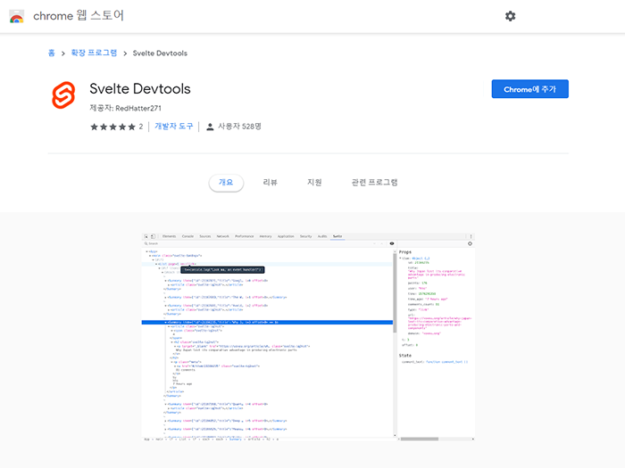
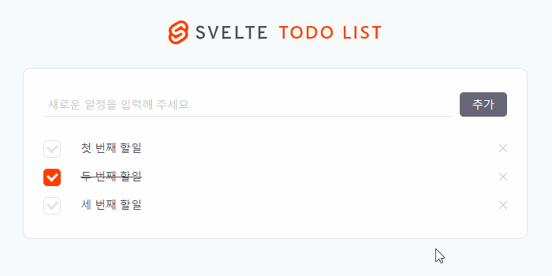
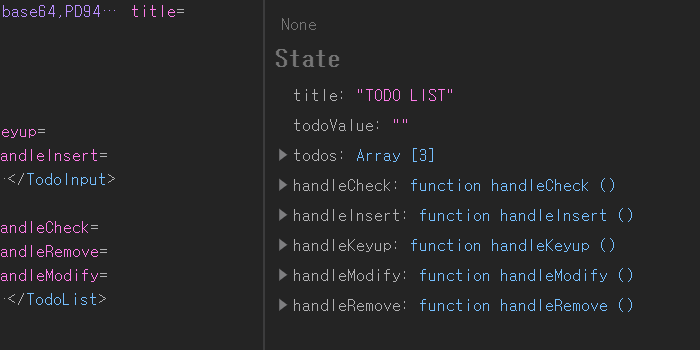

이 포스트는 [Svelte로 Todo List App 만들기(1) - 레이아웃](https://soulcactus.netlify.com/svelte/todo-list-1/)과 이어집니다.

## 📝 TodoInput 컴포넌트 : input 상태 관리(Update)

-   TodoInput 컴포넌트에서 prop을 정의하고 App.svelte에서 initial state를 할당합니다.

```javascript{3-5}
// src/components/TodoInput.svelte

<script>
  export let todoValue;
</script>

<style lang="scss">
  /* ... */
</style>

<input type="text" placeholder="새로운 일정을 입력해 주세요" />
<button type="button">추가</button>
```

```javascript{10, 16}
// src/App.svelte

<script>
  import PageTemplate from "~/components/PageTemplate.svelte";
  import logo from "~/images/svelte-logo-horizontal.svg";
  import TodoInput from "~/components/TodoInput.svelte";
  import TodoList from "~/components/TodoList.svelte";

  let title = 'TODO LIST';
  let todoValue = '';
</script>

<style lang="scss" src="./styles/global.scss"></style>

<PageTemplate {logo} {title}>
  <TodoInput {todoValue} />
  <TodoList />
</PageTemplate>
```

-   input 값 변경 이벤트 핸들러와, 추가 버튼 클릭 이벤트 핸들러도 미리 정의합니다.

```javascript{5-6}
// src/components/TodoInput.svelte

<script>
  export let todoValue;
  export let handleKeyup;
  export let handleInsert;
</script>

<style lang="scss">
  /* ... */
</style>

<input type="text" placeholder="새로운 일정을 입력해 주세요" />
<button type="button">추가</button>
```

### handleKeyup

####

-   App.svelte에서 handleKeyup 핸들러를 작성한 뒤 TodoInput 컴포넌트에 바인딩합니다.

####

```javascript{12-14, 20}
// src/App.svelte

<script>
  import PageTemplate from "~/components/PageTemplate.svelte";
  import logo from "~/images/svelte-logo-horizontal.svg";
  import TodoInput from "~/components/TodoInput.svelte";
  import TodoList from "~/components/TodoList.svelte";

  let title = 'TODO LIST';
  let todoValue = '';

  let handleKeyup = e => {
    todoValue = e.target.value; // keyup 이벤트 발생시 todoValue 값을 업데이트
  };
</script>

<style lang="scss" src="./styles/global.scss"></style>

<PageTemplate {logo} {title}>
  <TodoInput {todoValue} {handleKeyup} />
  <TodoList />
</PageTemplate>
```

```javascript{16}
// src/components/TodoInput.svelte

<script>
  export let todoValue;
  export let handleKeyup;
  export let handleInsert;
</script>

<style lang="scss">
  /* ... */
</style>

<input
    type="text"
    placeholder="새로운 일정을 입력해 주세요"
    on:keyup={e => handleKeyup(e)}
/>
<button type="button">추가</button>
```

SVELTE에서 요소에 이벤트를 바인딩할 때는 on:eventname 패턴으로 작성해야 합니다.

-   부모 컴포넌트의 상태값을 변경하기 위해 요소에 todoValue를 직접 바인딩합니다.

```javascript{16}
// src/components/TodoInput.svelte

<script>
  export let todoValue;
  export let handleKeyup;
  export let handleInsert;
</script>

<style lang="scss">
  /* ... */
</style>

<input
    type="text"
    placeholder="새로운 일정을 입력해 주세요"
    bind:value={todoValue}
    on:keyup={e => handleKeyup(e)}
/>
<button type="button">추가</button>
```

SVELTE에서 요소에 상태값을 바인딩할 때는 bind:property 패턴으로 작성해야 합니다. vue의 v-model과 거의 동일한 방식입니다(양방향 바인딩).

이제 input 값이 변경될 때마다 todoValue 값이 업데이트됩니다. 상태값이 잘 업데이트되고 있는지 확인하기 위해 SVELTE Chrome Extension을 설치합니다.

### Svelte Devtools 설치

####

-   [이곳](https://chrome.google.com/webstore/detail/svelte-devtools/ckolcbmkjpjmangdbmnkpjigpkddpogn)에서 설치합니다.

####



####

-   개발자 도구를 열어 상태값을 확인합니다.

####




변수를 선언하는 것만으로도 쉽게 상태를 관리할 수 있습니다.

## 📖 ToDoList/ToDoItem 컴포넌트 : 할일 목록 불러오기(Read)

-   TodoList 컴포넌트에서 prop을 정의하고 App.svelte에서 initial state를 할당합니다.

####

> id는 todo index, content는 todo 내용, done은 todo 완료 여부를 의미합니다.

####

```javascript{6}
// src/components/TodoList.svelte

<script>
  import TodoItem from "~/components/TodoItem.svelte";

  export let todos;
</script>

<style lang="scss">
  /* ... */
</style>

<ul>
  <TodoItem />
</ul>
```

```javascript{11-28, 39}
// src/App.svelte

<script>
  import PageTemplate from "~/components/PageTemplate.svelte";
  import logo from "~/images/svelte-logo-horizontal.svg";
  import TodoInput from "~/components/TodoInput.svelte";
  import TodoList from "~/components/TodoList.svelte";

  let title = 'TODO LIST';
  let todoValue = '';

  let todos = [
    {
      id: 0,
      content: '첫 번째 할일',
      done: false
    },
    {
      id: 1,
      content: '두 번째 할일',
      done: true
    },
    {
      id: 2,
      content: '세 번째 할일',
      done: false
    }
  ];

  let handleKeyup = e => {
    todoValue = e.target.value; // keyup 이벤트 발생시 todoValue 값을 업데이트
  };
</script>

<style lang="scss" src="./styles/global.scss"></style>

<PageTemplate {logo} {title}>
  <TodoInput {todoValue} {handleKeyup} />
  <TodoList {todos} />
</PageTemplate>
```

-   input 값 체크 이벤트 핸들러와, 아이템 삭제, 수정 이벤트 핸들러도 미리 정의합니다.

```javascript{7-9}
// src/components/TodoList.svelte

<script>
  import TodoItem from "~/components/TodoItem.svelte";

  export let todos;
  export let handleCheck;
  export let handleRemove;
  export let handleModify;
</script>

<style lang="scss">
  /* ... */
</style>

<ul>
  <TodoItem />
</ul>
```

-   그 다음 TodoItem 컴포넌트에 prop을 전달합니다.

```javascript{17-19}
// src/components/TodoList.svelte

<script>
  import TodoItem from "~/components/TodoItem.svelte";

  export let todos;
  export let handleCheck;
  export let handleRemove;
  export let handleModify;
</script>

<style lang="scss">
  /* ... */
</style>

<ul>
  {#each todos as todo}
    <TodoItem {todo} />
  {/each}
</ul>
```

SVELTE에서 반복문을 작성할 때는 {#each ...}를 사용합니다. 패턴은 아래와 같습니다.

-   {#each expression as name}...{/each}

```javascript
{#each items as item}
  <li>{item.name}</li>
{/each}
```

-   {#each expression as name, index}...{/each}

```javascript
{#each items as item, i}
	<li>{i + 1}: {item.name}</li>
{/each}
```

-   {#each expression as name}...{:else}...{/each}

```javascript
{#each todos as todo}
	<p>{todo.text}</p>
{:else}
	<p>No tasks today!</p>
{/each}
```

자세한 사항은 [이곳](https://svelte.dev/docs#each)의 {#each ...}를 참고하시기 바랍니다.

-   TodoItem 컴포넌트에도 동일하게 props를 정의합니다.

```javascript{6-9}
// src/components/TodoItem.svelte

<script>
  import icon from "~/images/remove-icon.svg";

  export let todo;
  export let handleCheck;
  export let handleRemove;
  export let handleModify;
</script>

<style lang="scss">
  /* ... */
</style>

<li>
  <input type="checkbox" id="todoCheck" class="chk-form" />
  <label for="todoCheck" />
  <span>할일</span>
  <button type="button">
    
  </button>
</li>
```

-   받아온 todo 데이터를 적용합니다.

####

> 완료된 todo에는 class="done"을 적용하고 그렇지 않은 경우에는 적용하지 않습니다.

####

```javascript{19, 21-29}
// src/components/TodoItem.svelte

<script>
  import icon from "~/images/remove-icon.svg";

  export let todo;
  export let handleCheck;
  export let handleRemove;
  export let handleModify;
</script>

<style lang="scss">
  /* ... */
</style>

<li>
  <input
    type="checkbox"
    id={`todoCheck${todo.id}`}
    class="chk-form"
    checked={todo.done} />
  <label for={`todoCheck${todo.id}`} />
  {#if todo.done}
    <span class="done">
      {todo.content}
    </span>
  {:else}
    <span>{todo.content}</span>
  {/if}
  <button type="button">
    
  </button>
</li>
```

SVELTE에서 조건문을 작성할 때는 {#if ...}를 사용합니다. 패턴은 아래와 같습니다.

-   {#if expression}...{/if}

```javascript
{#if answer === 42}
	<p>what was the question?</p>
{/if}
```

-   {#if expression}...{:else if expression}...{/if}

```javascript
{#if porridge.temperature > 100}
	<p>too hot!</p>
{:else if 80 > porridge.temperature}
	<p>too cold!</p>
{:else}
	<p>just right!</p>
{/if}
```

자세한 사항은 [이곳](https://svelte.dev/docs#if)의 {#if ...}를 참고하시기 바랍니다.

-   참고로 TodoItem 컴포넌트의 조건문은 아래와 같은 방법으로도 작성 가능합니다.

```javascript{23-25}
// src/components/TodoItem.svelte

<script>
  import icon from "~/images/remove-icon.svg";

  export let todo;
  export let handleCheck;
  export let handleRemove;
  export let handleModify;
</script>

<style lang="scss">
  /* ... */
</style>

<li>
  <input
    type="checkbox"
    id={`todoCheck${todo.id}`}
    class="chk-form"
    checked={todo.done} />
  <label for={`todoCheck${todo.id}`} />
  <span class:done={todo.done}>
    {todo.content}
  </span>
  <button type="button">
    
  </button>
</li>
```

자세한 사항은 [이곳](https://svelte.dev/docs#class_name)의 class:name을 참고하시기 바랍니다.

## 💬 마치며

기본적인 상태 관리와 데이터 불러오기 작업이 완료됐습니다. 다음 포스트에서는 데이터 생성, 읽기, 생신, 삭제(CRUD)를 마무리짓도록 하겠습니다.

1. [Svelte 설치하기(Quick Start)](https://soulcactus.netlify.com/svelte/start-svelte/)
2. [Svelte로 Todo List App 만들기(1) - 레이아웃](https://soulcactus.netlify.com/svelte/todo-list-1/)
3. [Svelte로 Todo List App 만들기(2) - 데이터 생성, 읽기, 갱신, 삭제(CRUD) Part.1](https://soulcactus.netlify.com/svelte/todo-list-2/)
4. [Svelte로 Todo List App 만들기(3) - 데이터 생성, 읽기, 갱신, 삭제(CRUD) Part.2](https://soulcactus.netlify.com/svelte/todo-list-3/)
5. [Svelte로 Todo List App 만들기(4) - 스토어를 이용한 상태 관리](https://soulcactus.netlify.com/svelte/todo-list-4/)

####

-   [DEMO](https://svelte-todo-list-demo.netlify.com/)
-   [GitHub Repo](https://github.com/soulcactus/svelte-todo-list)
