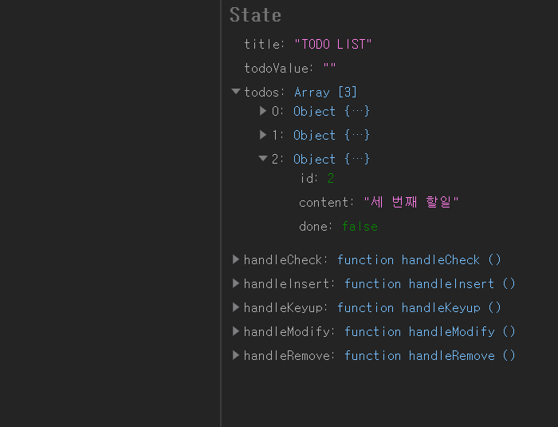
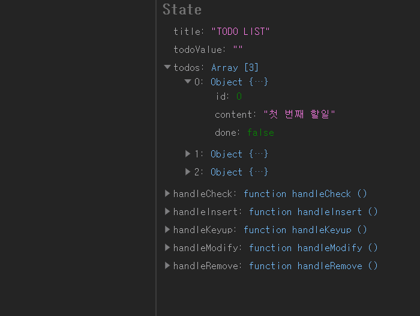
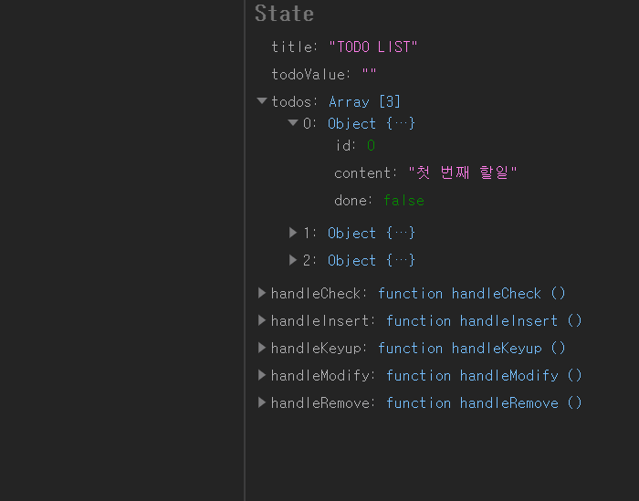

이 포스트는 [Svelte로 Todo List App 만들기(2) - 데이터 생성, 읽기, 갱신, 삭제(CRUD) Part.1](https://soulcactus.netlify.com/svelte/todo-list-2/)과 이어집니다.

## 📝 TodoInput 컴포넌트 : 새로운 할일 추가(Create)

-   App.svelte에서 todos의 마지막 item의 id를 todoId 변수에 할당합니다.

```javascript{29}
// src/App.svelte

<script>
  import PageTemplate from "~/components/PageTemplate.svelte";
  import logo from "~/images/svelte-logo-horizontal.svg";
  import TodoInput from "~/components/TodoInput.svelte";
  import TodoList from "~/components/TodoList.svelte";

  let title = 'TODO LIST';
  let todoValue = '';
  let todos = [
    {
      id: 0,
      content: '첫 번째 할일',
      done: false
    },
    {
      id: 1,
      content: '두 번째 할일',
      done: true
    },
    {
      id: 2,
      content: '세 번째 할일',
      done: false
    }
  ];

  let todoId = todos[todos.length - 1]['id']; // todos의 마지막 item의 id

  let handleKeyup = e => {
    todoValue = e.target.value; // keyup 이벤트 발생시 todoValue 값을 업데이트
  };
</script>

<style lang="scss" src="./styles/global.scss"></style>

<PageTemplate {logo} {title}>
  <TodoInput {todoValue} {handleKeyup} />
  <TodoList {todos} />
</PageTemplate>
```

### handleInsert

####

-   handleInsert 핸들러를 작성한 뒤 TodoInput 컴포넌트에 바인딩합니다.

####

> handleInsert는 todoValue가 빈 값이 아닌 경우 todos에 새로운 todo를 추가합니다. todoValue가 빈 값인 경우 경고창을 띄웁니다.

####

```javascript{31-44, 54}
// src/App.svelte

<script>
  import PageTemplate from "~/components/PageTemplate.svelte";
  import logo from "~/images/svelte-logo-horizontal.svg";
  import TodoInput from "~/components/TodoInput.svelte";
  import TodoList from "~/components/TodoList.svelte";

  let title = 'TODO LIST';
  let todoValue = '';
  let todos = [
    {
      id: 0,
      content: '첫 번째 할일',
      done: false
    },
    {
      id: 1,
      content: '두 번째 할일',
      done: true
    },
    {
      id: 2,
      content: '세 번째 할일',
      done: false
    }
  ];

  let todoId = todos[todos.length - 1]['id']; // todos의 마지막 item의 id

  let handleInsert = () => {
    if (todoValue) {
      const newTodo = {
        id: ++todoId,
        content: todoValue,
        done: false
      };

      todos[todos.length] = newTodo;
      todoValue = '';
    } else {
      alert('내용을 입력해 주세요.');
    }
  };

  let handleKeyup = e => {
    todoValue = e.target.value; // keyup 이벤트 발생시 todoValue 값을 업데이트
  };
</script>

<style lang="scss" src="./styles/global.scss"></style>

<PageTemplate {logo} {title}>
  <TodoInput {todoValue} {handleKeyup} {handleInsert} />
  <TodoList {todos} />
</PageTemplate>
```

```javascript{19}
// src/components/TodoInput.svelte

<script>
  export let todoValue;
  export let handleKeyup;
  export let handleInsert;
</script>

<style lang="scss">
  /* ... */
</style>

<input
    type="text"
    placeholder="새로운 일정을 입력해 주세요"
    bind:value={todoValue}
    on:keyup={e => handleKeyup(e)}
/>
<button type="button" on:click={handleInsert}>추가</button>
```

### handleKeyup

-   Enter key를 이용해 일정을 추가할 수 있도록 handleKeyup을 수정합니다.

```javascript{8-10}
// src/App.svelte

<script>
  /* ... */
  let handleKeyup = e => {
    todoValue = e.target.value; // keyup 이벤트 발생시 todoValue 값을 업데이트

    if (e.keyCode === 13) {
      handleInsert();
    }
  };
</script>
/* ... */
```

이제 새로운 할일을 등록할 수 있습니다.

####


####

## ✅ ToDoItem 컴포넌트 : 할일 완료(Update)

### handleCheck

####

-   App.svelte에서 handleCheck 핸들러를 작성한 뒤 TodoItem 컴포넌트에 바인딩합니다.

####

```javascript{31-35, 61}
// src/App.svelte

<script>
  import PageTemplate from "~/components/PageTemplate.svelte";
  import logo from "~/images/svelte-logo-horizontal.svg";
  import TodoInput from "~/components/TodoInput.svelte";
  import TodoList from "~/components/TodoList.svelte";

  let title = 'TODO LIST';
  let todoValue = '';
  let todos = [
    {
      id: 0,
      content: '첫 번째 할일',
      done: false
    },
    {
      id: 1,
      content: '두 번째 할일',
      done: true
    },
    {
      id: 2,
      content: '세 번째 할일',
      done: false
    }
  ];

  let todoId = todos[todos.length - 1]['id']; // todos의 마지막 item의 id

  let handleCheck = (id, done) => {
    const index = todos.findIndex(todo => todo.id === id);

    todos[index]['done'] = !done;
  };

  let handleInsert = () => {
    if (todoValue) {
      const newTodo = {
        id: ++todoId,
        content: todoValue,
        done: false
      };

      todos[todos.length] = newTodo;
      todoValue = '';
    } else {
      alert('내용을 입력해 주세요.');
    }
  };

  let handleKeyup = e => {
    todoValue = e.target.value; // keyup 이벤트 발생시 todoValue 값을 업데이트
  };
</script>

<style lang="scss" src="./styles/global.scss"></style>

<PageTemplate {logo} {title}>
  <TodoInput {todoValue} {handleKeyup} {handleInsert} />
  <TodoList {todos} {handleCheck} />
</PageTemplate>
```

```javascript{20}
// src/components/todoList.svelte

<script>
  import TodoItem from "~/components/TodoItem.svelte";

  export let todos;
  export let handleCheck;
  export let handleRemove;
  export let handleModify;
</script>

<style lang="scss">
  ul {
    padding: 0.9rem 0 1.2rem;
  }
</style>

<ul>
  {#each todos as todo}
    <TodoItem {todo} {handleCheck} />
  {/each}
</ul>

```

```javascript{21}
// src/components/TodoItem.svelte

<script>
  import icon from "~/images/remove-icon.svg";

  export let todo;
  export let handleCheck;
  export let handleRemove;
  export let handleModify;
</script>

<style lang="scss">
  /* ... */
</style>

<li>
  <input
    type="checkbox"
    id={`todoCheck${todo.id}`}
    class="chk-form"
    on:click={() => handleCheck(todo.id, todo.done)}
    checked={todo.done} />
  <label for={`todoCheck${todo.id}`} />
  <span class:done={todo.done}>
    {todo.content}
  </span>
  <button type="button">
    
  </button>
</li>
```

이제 완료된 할일을 체크할 수 있습니다.

####




####

## ✍️ ToDoItem 컴포넌트 : 할일 수정(Update)

### handleModify

####

-   App.svelte에서 handleModify 핸들러를 작성한 뒤 TodoItem 컴포넌트에 바인딩합니다.

####

> contenteditable 속성을 활용해 작성했습니다. todo 내용을 더블클릭시 contenteditable 속성이 추가 되고 내용 수정 후 blur시 상태가 업데이트됩니다.

####

```javascript{56-69, 76}
// src/App.svelte

<script>
  import PageTemplate from "~/components/PageTemplate.svelte";
  import logo from "~/images/svelte-logo-horizontal.svg";
  import TodoInput from "~/components/TodoInput.svelte";
  import TodoList from "~/components/TodoList.svelte";

  let title = 'TODO LIST';
  let todoValue = '';
  let todos = [
    {
      id: 0,
      content: '첫 번째 할일',
      done: false
    },
    {
      id: 1,
      content: '두 번째 할일',
      done: true
    },
    {
      id: 2,
      content: '세 번째 할일',
      done: false
    }
  ];

  let todoId = todos[todos.length - 1]['id']; // todos의 마지막 item의 id

  let handleCheck = (id, done) => {
    const index = todos.findIndex(todo => todo.id === id);

    todos[index]['done'] = !done;
  };

  let handleInsert = () => {
    if (todoValue) {
      const newTodo = {
        id: ++todoId,
        content: todoValue,
        done: false
      };

      todos[todos.length] = newTodo;
      todoValue = '';
    } else {
      alert('내용을 입력해 주세요.');
    }
  };

  let handleKeyup = e => {
    todoValue = e.target.value; // keyup 이벤트 발생시 todoValue 값을 업데이트
  };

  let handleModify = (e, id) => {
    const element = e.target;
    const index = todos.findIndex(todo => todo.id === id);

    const modify = function() {
      element.removeAttribute('contenteditable');
      todos[index]['content'] = element.textContent;
      element.removeEventListener('blur', modify, false);
    };

    element.setAttribute('contenteditable', true);
    element.focus();
    element.addEventListener('blur', modify, false);
  };
</script>

<style lang="scss" src="./styles/global.scss"></style>

<PageTemplate {logo} {title}>
  <TodoInput {todoValue} {handleKeyup} {handleInsert} />
  <TodoList {todos} {handleCheck} {handleModify} />
</PageTemplate>
```

```javascript{20}
// src/components/todoList.svelte

<script>
  import TodoItem from "~/components/TodoItem.svelte";

  export let todos;
  export let handleCheck;
  export let handleRemove;
  export let handleModify;
</script>

<style lang="scss">
  ul {
    padding: 0.9rem 0 1.2rem;
  }
</style>

<ul>
  {#each todos as todo}
    <TodoItem {todo} {handleCheck} {handleModify} />
  {/each}
</ul>
```

```javascript{24}
// src/components/TodoItem.svelte

<script>
  import icon from "~/images/remove-icon.svg";

  export let todo;
  export let handleCheck;
  export let handleRemove;
  export let handleModify;
</script>

<style lang="scss">
  /* ... */
</style>

<li>
  <input
    type="checkbox"
    id={`todoCheck${todo.id}`}
    class="chk-form"
    on:click={() => handleCheck(todo.id, todo.done)}
    checked={todo.done} />
  <label for={`todoCheck${todo.id}`} />
  <span class:done={todo.done} on:dblclick={e => handleModify(e, todo.id)}>
    {todo.content}
  </span>
  <button type="button">
    
  </button>
</li>
```

이제 할일을 수정할 수 있습니다.

####




####

## ❌ ToDoItem 컴포넌트 : 할일 삭제(Delete)

### handleRemove

-   App.svelte에서 handleRemove 핸들러를 작성한 뒤 TodoItem 컴포넌트에 바인딩합니다.

```javascript{71-80, 87}
// src/App.svelte

<script>
  import PageTemplate from "~/components/PageTemplate.svelte";
  import logo from "~/images/svelte-logo-horizontal.svg";
  import TodoInput from "~/components/TodoInput.svelte";
  import TodoList from "~/components/TodoList.svelte";

  let title = 'TODO LIST';
  let todoValue = '';
  let todos = [
    {
      id: 0,
      content: '첫 번째 할일',
      done: false
    },
    {
      id: 1,
      content: '두 번째 할일',
      done: true
    },
    {
      id: 2,
      content: '세 번째 할일',
      done: false
    }
  ];

  let todoId = todos[todos.length - 1]['id']; // todos의 마지막 item의 id

  let handleCheck = (id, done) => {
    const index = todos.findIndex(todo => todo.id === id);

    todos[index]['done'] = !done;
  };

  let handleInsert = () => {
    if (todoValue) {
      const newTodo = {
        id: ++todoId,
        content: todoValue,
        done: false
      };

      todos[todos.length] = newTodo;
      todoValue = '';
    } else {
      alert('내용을 입력해 주세요.');
    }
  };

  let handleKeyup = e => {
    todoValue = e.target.value; // keyup 이벤트 발생시 todoValue 값을 업데이트
  };

  let handleModify = (e, id) => {
    const element = e.target;
    const index = todos.findIndex(todo => todo.id === id);

    const modify = function() {
      element.removeAttribute('contenteditable');
      todos[index]['content'] = element.textContent;
      element.removeEventListener('blur', modify, false);
    };

    element.setAttribute('contenteditable', true);
    element.focus();
    element.addEventListener('blur', modify, false);
  };

  let handleRemove = id => {
    const index = todos.findIndex(todo => todo.id === id);

    const newTodos = [
      ...todos.slice(0, index),
      ...todos.slice(index + 1, todos.length)
    ];

    todos = newTodos;
  };
</script>

<style lang="scss" src="./styles/global.scss"></style>

<PageTemplate {logo} {title}>
  <TodoInput {todoValue} {handleKeyup} {handleInsert} />
  <TodoList {todos} {handleCheck} {handleModify} {handleRemove} />
</PageTemplate>
```

```javascript{20}
// src/components/todoList.svelte

<script>
  import TodoItem from "~/components/TodoItem.svelte";

  export let todos;
  export let handleCheck;
  export let handleRemove;
  export let handleModify;
</script>

<style lang="scss">
  ul {
    padding: 0.9rem 0 1.2rem;
  }
</style>

<ul>
  {#each todos as todo}
    <TodoItem {todo} {handleCheck} {handleModify} {handleRemove} />
  {/each}
</ul>
```

```javascript{27}
// src/components/TodoItem.svelte

<script>
  import icon from "~/images/remove-icon.svg";

  export let todo;
  export let handleCheck;
  export let handleRemove;
  export let handleModify;
</script>

<style lang="scss">
  /* ... */
</style>

<li>
  <input
    type="checkbox"
    id={`todoCheck${todo.id}`}
    class="chk-form"
    on:click={() => handleCheck(todo.id, todo.done)}
    checked={todo.done} />
  <label for={`todoCheck${todo.id}`} />
  <span class:done={todo.done} on:dblclick={e => handleModify(e, todo.id)}>
    {todo.content}
  </span>
  <button type="button" on:click={() => handleRemove(todo.id)}>
    
  </button>
</li>
```

이제 할일을 삭제할 수 있습니다.

####




####

## 💬 마치며

기본적인 todo list app 만들기 작업이 완료됐습니다. 다음 포스트에서는 지금까지 만든 todo list app을 기반으로 SVELTE store에 대해 다루도록 하겠습니다.

1. [Svelte 설치하기(Quick Start)](https://soulcactus.netlify.com/svelte/start-svelte/)
2. [Svelte로 Todo List App 만들기(1) - 레이아웃](https://soulcactus.netlify.com/svelte/todo-list-1/)
3. [Svelte로 Todo List App 만들기(2) - 데이터 생성, 읽기, 갱신, 삭제(CRUD) Part.1](https://soulcactus.netlify.com/svelte/todo-list-2/)
4. [Svelte로 Todo List App 만들기(3) - 데이터 생성, 읽기, 갱신, 삭제(CRUD) Part.2](https://soulcactus.netlify.com/svelte/todo-list-3/)
5. [Svelte로 Todo List App 만들기(4) - 스토어를 이용한 상태 관리](https://soulcactus.netlify.com/svelte/todo-list-4/)

####

-   [DEMO](https://svelte-todo-list-demo.netlify.com/)
-   [GitHub Repo](https://github.com/soulcactus/svelte-todo-list)
