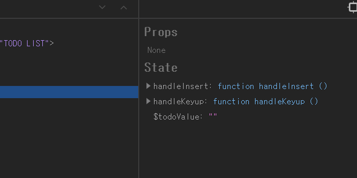
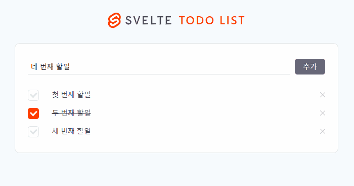
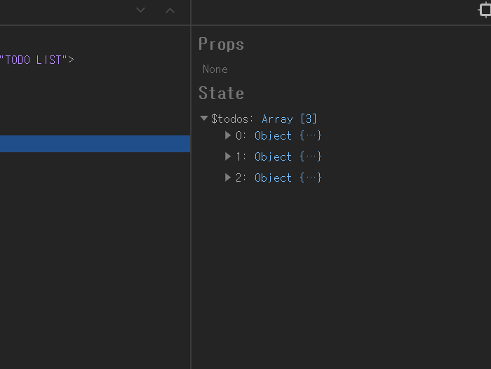
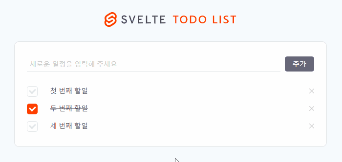
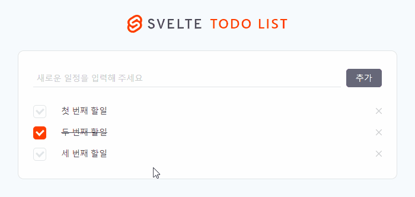
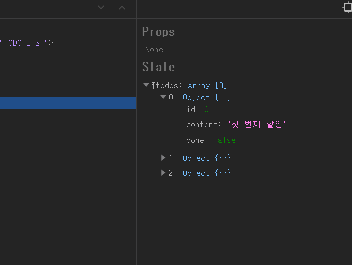
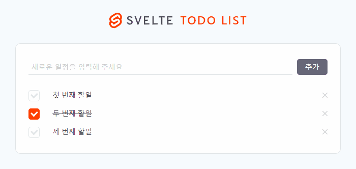

이 포스트는 [Svelte로 Todo List App 만들기(3) - 데이터 생성, 읽기, 갱신, 삭제(CRUD) Part.2](https://soulcactus.netlify.com/svelte/todo-list-3/)와 이어집니다.

## 📦 Svelte Store

지난 포스트에서는 state를 최상위 부모 컴포넌트인 App.svelte에서 관리했는데요, 이 경우 실제로 그 상태값이 필요한 자식 컴포넌트까지 props로 값을 계속 내려줘야 하는 불편함이 있습니다. 물론 컴포넌트 합성, Context API를 통해 해결할 수 있으나 여러 컴포넌트에서 자주 업데이트가 일어나는 상태값인 경우 store를 이용해 전역적으로 관리해 주는 것이 좋습니다. Svelte는 기본적으로 store 기능을 제공하고 있기 때문에 별도의 상태 관리 라이브러리가 필요하지 않습니다.

컴포넌트 합성과 Context API에 대한 자세한 사항은 [이곳](https://ko.reactjs.org/docs/context.html)을 참고하시기 바랍니다. Svelte도 Context API를 제공하고 있습니다만, 이 포스트에서는 다루지 않겠습니다. Svelte의 Context API는 [이곳](https://svelte.dev/docs#script_context_module)의 context를 참고하시기 바랍니다.

## 💎 store 생성

-   src 디렉토리에 store.js 파일을 생성합니다.

```tree
└─src
    │  App.svelte
    │  main.js
    │  store.js // new!
    │
    ├─components
    │      PageTemplate.svelte
    │      TodoInput.svelte
    │      TodoItem.svelte
    │      TodoList.svelte
    │
    ├─images
    │      remove-icon.svg
    │      svelte-logo-horizontal.svg
    │
    └─styles
            global.scss
            modules.scss
            variables.scss
```

## 📝 todoValue

먼저 TodoInput.svelte 컴포넌트의 입력폼을 변경하면 업데이트되는 상태값인 todoValue를 store에서 관리하도록 하겠습니다.

-   우선 writable을 import합니다.

####

> writable이란 컴포넌트에서 사용할 수 있는 값을 가진 store를 생성하는 기능으로, set과 update 메소드를 제공합니다.

####

```javascript{3}
// src/store.js

import { writable } from 'svelte/store';
```

자세한 사항은 [이곳](https://svelte.dev/docs#writable)의 writable을 참고하시기 바랍니다.

####

-   그 다음 커스텀 스토어를 아래와 같이 생성합니다.

####

> store는 상태값이 바뀔 때마다 store를 구독하고 있는 컴포넌트에 이를 전달합니다. 모든 스토어는 반드시 subscribe 메소드를 포함해야 합니다. todoValue의 경우 입력폼이 변경될 때마다 값이 업데이트돼야 하므로 set 메소드도 함께 할당합니다.

####

```javascript{5-12}
// src/store.js

import { writable } from 'svelte/store';

function setTodoValue() {
    const { subscribe, set } = writable('');

    return {
        subscribe,
        keyup: (value) => set(value),
    };
}
```

리덕스에 빗대어 표현하면 keyup은 액션 타입에 해당하고, keyup에 할당된 (value) => set(value) 함수는 리듀서에 해당합니다.

####

-   그 다음 todoValue를 export합니다.

```javascript{14}
// src/store.js

import { writable } from 'svelte/store';

function setTodoValue() {
    const { subscribe, set } = writable('');

    return {
        subscribe,
        keyup: (value) => set(value),
    };
}

export const todoValue = setTodoValue();
```

-   App.svelte를 수정합니다.

```javascript{3-19}
// src/App.svelte

<script>
  import PageTemplate from "~/components/PageTemplate.svelte";
  import logo from "~/images/svelte-logo-horizontal.svg";
  import TodoInput from "~/components/TodoInput.svelte";
  import TodoList from "~/components/TodoList.svelte";

  let title = 'TODO LIST';
</script>

<style lang="scss" src="./styles/global.scss">

</style>

<PageTemplate {logo} {title}>
  <TodoInput />
  <TodoList />
</PageTemplate>
```

각각의 자식 컴포넌트에서 store를 구독할 예정이므로 과감하게(?) 지워줍니다. 멀쩡했던 앱이 텅텅 빈 페이지로 출력되지만 잠시 못 본 체(?) 합니다.

## 📝 todos

-   먼저 initial state와 todoId를 설정합니다.

```javascript{5-21, 23}
// src/store.js

import { writable } from 'svelte/store';

const todoList = [
    {
        id: 0,
        content: '첫 번째 할일',
        done: false,
    },
    {
        id: 1,
        content: '두 번째 할일',
        done: true,
    },
    {
        id: 2,
        content: '세 번째 할일',
        done: false,
    },
];

let todoId = todoList[todoList.length - 1]['id'];

function setTodoValue() {
    const { subscribe, set } = writable('');

    return {
        subscribe,
        keyup: (value) => set(value),
    };
}

export const todoValue = setTodoValue();
```

-   todos 스토어를 생성하고 insert 액션타입과 리듀서를 정의합니다. (Svelte에서는 공식적으로 액션타입과 리듀서라는 용어를 사용하지 않지만 편의상 이렇게 설명하겠습니다.)

```javascript{34-52}
// src/store.js

import { writable } from 'svelte/store';

const todoList = [
    {
        id: 0,
        content: '첫 번째 할일',
        done: false,
    },
    {
        id: 1,
        content: '두 번째 할일',
        done: true,
    },
    {
        id: 2,
        content: '세 번째 할일',
        done: false,
    },
];

let todoId = todoList[todoList.length - 1]['id'];

function setTodoValue() {
    const { subscribe, set } = writable('');

    return {
        subscribe,
        keyup: (value) => set(value),
    };
}

function setTodo() {
    const { subscribe, update } = writable(todoList);

    return {
        subscribe,
        insert: (value) =>
            update((list) => {
                const newList = [...list];

                const newTodo = {
                    id: ++todoId,
                    content: value,
                    done: false,
                };

                return [...newList, newTodo];
            }),
    };
}

export const todoValue = setTodoValue();
```

insert를 설명하기에 앞서 지난 번에 작성했던 handleInsert 함수를 살펴보겠습니다.

```javascript
// src/App.svelte

/* ... */

let handleInsert = () => {
    if (todoValue) {
        const newTodo = {
            id: ++todoId,
            content: todoValue,
            done: false,
        };

        todos[todos.length] = newTodo;
        todoValue = '';
    } else {
        alert('내용을 입력해 주세요.');
    }
};

/* ... */
```

거의 동일하게 옮겼습니다. 로직은 아래와 같습니다.

1. insert는 value(할일 내용)를 파라미터로 받습니다.
2. update 메소드는 현재 할일 목록을 파라미터로 받습니다.
3. newList에 현재 할일 목록을 복사합니다.

####

> 리덕스의 리듀서 원칙에 따라 이전의 상태를 직접 수정하지 않고 현재 할일 목록을 newList에 복사했습니다. const newList = list 로 할당할 경우 복사가 아니라 참조되므로 spread 연산자를 사용했습니다.

####

4. 새로운 리스트를 반환합니다.

####

-   check 액션 타입과 리듀서를 정의합니다.

```javascript{51-59}
// src/store.js

import { writable } from 'svelte/store';

const todoList = [
    {
        id: 0,
        content: '첫 번째 할일',
        done: false,
    },
    {
        id: 1,
        content: '두 번째 할일',
        done: true,
    },
    {
        id: 2,
        content: '세 번째 할일',
        done: false,
    },
];

let todoId = todoList[todoList.length - 1]['id'];

function setTodoValue() {
    const { subscribe, set } = writable('');

    return {
        subscribe,
        keyup: (value) => set(value),
    };
}

function setTodo() {
    const { subscribe, update } = writable(todoList);

    return {
        subscribe,
        insert: (value) =>
            update((list) => {
                const newList = [...list];

                const newTodo = {
                    id: ++todoId,
                    content: value,
                    done: false,
                };

                return [...newList, newTodo];
            }),
        check: (id) =>
            update((list) => {
                const newList = [...list];
                const index = newList.findIndex((todo) => todo['id'] === id);

                newList[index]['done'] = !newList[index]['done'];

                return newList;
            }),
    };
}

export const todoValue = setTodoValue();
```

마찬가지로 지난 번에 작성했던 handleCheck 함수를 거의 동일하게 옮겼습니다. (이하 생략)

```javascript
// src/App.svelte

/* ... */

let handleCheck = (id, done) => {
    const index = todos.findIndex((todo) => todo.id === id);

    todos[index]['done'] = !done;
};
/* ... */
```

-   modify 액션 타입과 리듀서를 정의합니다.

```javascript{60-68}
// src/store.js

import { writable } from 'svelte/store';

const todoList = [
    {
        id: 0,
        content: '첫 번째 할일',
        done: false,
    },
    {
        id: 1,
        content: '두 번째 할일',
        done: true,
    },
    {
        id: 2,
        content: '세 번째 할일',
        done: false,
    },
];

let todoId = todoList[todoList.length - 1]['id'];

function setTodoValue() {
    const { subscribe, set } = writable('');

    return {
        subscribe,
        keyup: (value) => set(value),
    };
}

function setTodo() {
    const { subscribe, update } = writable(todoList);

    return {
        subscribe,
        insert: (value) =>
            update((list) => {
                const newList = [...list];

                const newTodo = {
                    id: ++todoId,
                    content: value,
                    done: false,
                };

                return [...newList, newTodo];
            }),
        check: (id) =>
            update((list) => {
                const newList = [...list];
                const index = newList.findIndex((todo) => todo['id'] === id);

                newList[index]['done'] = !newList[index]['done'];

                return newList;
            }),
        modify: (id, text) =>
            update((list) => {
                const newList = [...list];
                const index = newList.findIndex((todo) => todo['id'] === id);

                newList[index]['content'] = text;

                return newList;
            }),
    };
}

export const todoValue = setTodoValue();
```

-   remove 액션 타입과 리듀서를 정의한 다음 todos를 export합니다.

```javascript{69-80, 85}
// src/store.js

import { writable } from 'svelte/store';

const todoList = [
    {
        id: 0,
        content: '첫 번째 할일',
        done: false,
    },
    {
        id: 1,
        content: '두 번째 할일',
        done: true,
    },
    {
        id: 2,
        content: '세 번째 할일',
        done: false,
    },
];

let todoId = todoList[todoList.length - 1]['id'];

function setTodoValue() {
    const { subscribe, set } = writable('');

    return {
        subscribe,
        keyup: (value) => set(value),
    };
}

function setTodo() {
    const { subscribe, update } = writable(todoList);

    return {
        subscribe,
        insert: (value) =>
            update((list) => {
                const newList = [...list];

                const newTodo = {
                    id: ++todoId,
                    content: value,
                    done: false,
                };

                return [...newList, newTodo];
            }),
        check: (id) =>
            update((list) => {
                const newList = [...list];
                const index = newList.findIndex((todo) => todo['id'] === id);

                newList[index]['done'] = !newList[index]['done'];

                return newList;
            }),
        modify: (id, text) =>
            update((list) => {
                const newList = [...list];
                const index = newList.findIndex((todo) => todo['id'] === id);

                newList[index]['content'] = text;

                return newList;
            }),
        remove: (id) =>
            update((list) => {
                const newList = [...list];
                const index = newList.findIndex((todo) => todo['id'] === id);

                const newTodos = [
                    ...newList.slice(0, index),
                    ...newList.slice(index + 1, newList.length),
                ];

                return newTodos;
            }),
    };
}

export const todoValue = setTodoValue();
export const todos = setTodo();
```

스토어가 완성됐습니다.

## 📝 TodoInput 컴포넌트 : store 구독

-   script 부분에 props를 지우고 todos와 todoValue를 import합니다.

```javascript{4}
// src/components/TodoInput.svelte

<script>import {(todos, todoValue)} from "~/store.js";</script>

/* ... */
```

-   마크업을 다음과 같이 수정합니다.

```javascript{8-9}
// src/components/TodoInput.svelte

/* ... */

<input
  type="text"
  placeholder="새로운 일정을 입력해 주세요"
  value={$todoValue}
  on:keyup={handleKeyup} />
<button type="button" on:click={handleInsert}>추가</button>
```

현재 상태값은 \$ 접두사를 이용해 참조합니다. 이때, store의 상태값을 바인딩할 때는 bind:value 대신 value를 사용해야 합니다. bind:value를 사용할 경우 에러가 발생합니다.

####

-   handleKeyup과 handleInsert 함수를 작성합니다.

```javascript{6-21}
// src/components/TodoInput.svelte

<script>
import {todos, todoValue} from "~/store.js";

const handleInsert = () => {
    if ($todoValue) {
      todos.insert($todoValue);
      todoValue.keyup('');
    } else {
      alert('내용을 입력해 주세요.');
    }
  };

const handleKeyup = e => {
    todoValue.keyup(e.target.value);

    if (e.keyCode === 13) {
        handleInsert();
    }
};
</script>

/* ... */
```

보시는 바와 같이 storeName.actionType(parameter) 형태로 리듀서를 실행할 수 있습니다.

## 📝 TodoList 컴포넌트 : store 구독

-   마찬가지로 script와 마크업을 수정합니다.

```javascript{5, 15-17}
// src/components/TodoList.svelte

<script>
  import TodoItem from "~/components/TodoItem.svelte";
  import { todos } from "~/store.js";
</script>

<style lang="scss">
  ul {
    padding: 0.9rem 0 1.2rem;
  }
</style>

<ul>
  {#each $todos as todo}
    <TodoItem {todo} />
  {/each}
</ul>
```

## 📝 TodoItem 컴포넌트 : store 구독

-   script를 수정합니다.

```javascript{5, 9-21}
// src/components/TodoItem.svelte

<script>
  import icon from "~/images/remove-icon.svg";
  import { todos } from "~/store.js";

  export let todo;

  const handleModify = (id, element) => {
    const index = $todos.findIndex(todo => todo['id'] === id);

    const modify = function() {
      element.removeAttribute('contenteditable');
      todos.modify(id, element.textContent);
      element.removeEventListener('blur', modify, false);
    };

    element.setAttribute('contenteditable', true);
    element.focus();
    element.addEventListener('blur', modify, false);
  };
</script>

/* ... */
```

TodoList 컴포넌트에서 todo prop을 받아야 하므로 export let todo는 지우지 않습니다.

####

-   마크업을 수정합니다.

```javascript{5-23}
// src/components/TodoItem.svelte

/* ... */

<li>
    <input
        type="checkbox"
        id={`todoCheck${todo['id']}`}
        class="chk-form"
        on:click={() => todos.check(todo['id'])}
        checked={todo['done']}
    />
    <label for={`todoCheck${todo['id']}`} />
    <span
        class:done={todo['done']}
        on:dblclick={(e) => handleModify(todo['id'], e.target)}
    >
        {todo['content']}
    </span>
    <button type="button" on:click={() => todos.remove(todo['id'])}>
        
    </button>
</li>
```

## ✅ Svelte Devtools에서 확인

개발자 도구를 열어 상태값을 확인합니다.

####

-   입력폼 업데이트를 확인합니다.

####




####

-   할일이 추가되는지 확인합니다.

####




####

-   할일이 완료되는지 확인합니다.

####




####

-   할일이 수정되는지 확인합니다.

####




####

-   할일이 삭제되는지 확인합니다.

####




## 💬 마치며

기본적인 todo list app 만들기에 이어 store를 다루는 법도 알아봤습니다.

1. [Svelte 설치하기(Quick Start)](https://soulcactus.netlify.com/svelte/start-svelte/)
2. [Svelte로 Todo List App 만들기(1) - 레이아웃](https://soulcactus.netlify.com/svelte/todo-list-1/)
3. [Svelte로 Todo List App 만들기(2) - 데이터 생성, 읽기, 갱신, 삭제(CRUD) Part.1](https://soulcactus.netlify.com/svelte/todo-list-2/)
4. [Svelte로 Todo List App 만들기(3) - 데이터 생성, 읽기, 갱신, 삭제(CRUD) Part.2](https://soulcactus.netlify.com/svelte/todo-list-3/)
5. [Svelte로 Todo List App 만들기(4) - 스토어를 이용한 상태 관리](https://soulcactus.netlify.com/svelte/todo-list-4/)

####

-   [DEMO](https://svelte-todo-list-demo.netlify.com/)
-   [GitHub Repo](https://github.com/soulcactus/svelte-todo-list)
